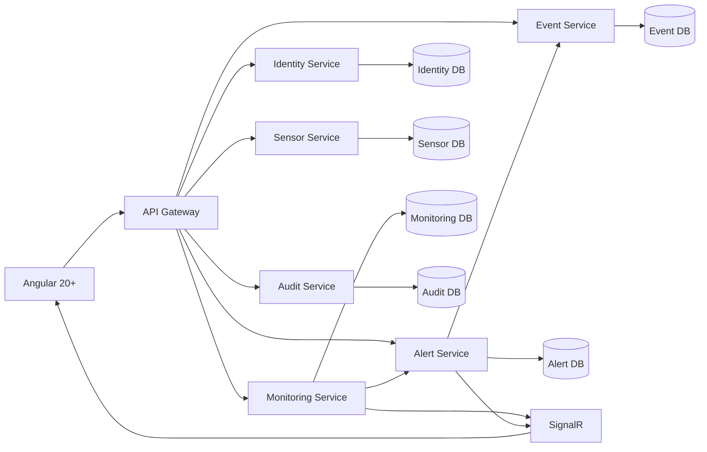

Quiero que actúes como **Software Architect y Senior Backend Developer especializado en C# .NET 10, microservicios, SQL Server, Docker, APIs REST, SignalR y arquitectura limpia**.

Debes diseñar e implementar el **backend completo** de un proyecto académico llamado:

# Sistema Web de Monitoreo y Alerta Temprana para Riesgos Climáticos

El backend será consumido posteriormente por un frontend desarrollado en **Angular 20+**.

## 1. Objetivo general

Construir un backend basado en **microservicios con C# .NET 10+** para una aplicación que simula un sistema de monitoreo y alerta temprana para riesgos climáticos en comunidades rurales.

El sistema deberá permitir:

- Monitorear variables climáticas.
- Simular lecturas de sensores en tiempo real.
- Detectar automáticamente condiciones de riesgo.
- Generar alertas climáticas.
- Clasificar las alertas según niveles de peligro.
- Registrar el historial de eventos.
- Administrar sensores.
- Administrar usuarios autenticados.
- Registrar una bitácora de acciones.
- Enviar información en tiempo real al frontend.
- Permitir incorporar nuevos sensores o comunidades sin tener que rediseñar la arquitectura.

---

# 2. Stack tecnológico obligatorio

Utilizar:

- C#.
- .NET 10 o superior.
- ASP.NET Core Web API.
- Entity Framework Core.
- SQL Server 2022 o superior.
- SignalR para comunicación en tiempo real.
- JWT Bearer Authentication.
- Docker.
- Docker Compose.
- GNU/Linux como sistema operativo de despliegue.
- Swagger / OpenAPI para documentación.
- xUnit para pruebas.
- FluentValidation para validaciones.

Puedes utilizar paquetes adicionales cuando sean necesarios, pero deben justificarse.

No utilizar una arquitectura monolítica.

---

# 3. Arquitectura general

Implementar la solución utilizando una arquitectura de microservicios.

Propongo inicialmente los siguientes componentes:

```text
Angular 20+
     |
     v
API Gateway
     |
     +--------------------------------------------+
     |             |            |                |
     v             v            v                v
Identity       Sensors      Monitoring        Alerts
Service        Service       Service          Service
                                               |
                                               v
                                          Events Service

                 +----------------+
                 |  Audit Service |
                 +----------------+

Todos los servicios:
        |
        v
 SQL Server 2022+
```

Cada microservicio debe ser independiente a nivel de responsabilidad.

Cuando sea posible, aplicar el principio:

```text
Database per Service
```

Aunque todas las bases de datos utilicen SQL Server 2022.

No compartir directamente tablas entre microservicios.

La comunicación entre servicios deberá realizarse mediante APIs o mecanismos de comunicación explícitos.

---

# 4. Estructura de la solución

Crear una solución similar a:

```text
ClimateMonitoringSystem/
│
├── src/
│   │
│   ├── Gateway/
│   │
│   ├── Services/
│   │   ├── IdentityService/
│   │   ├── SensorService/
│   │   ├── MonitoringService/
│   │   ├── AlertService/
│   │   ├── EventService/
│   │   └── AuditService/
│   │
│   └── BuildingBlocks/
│       ├── SharedKernel/
│       └── Contracts/
│
├── tests/
│   ├── IdentityService.Tests/
│   ├── SensorService.Tests/
│   ├── MonitoringService.Tests/
│   ├── AlertService.Tests/
│   ├── EventService.Tests/
│   └── AuditService.Tests/
│
├── docker-compose.yml
├── .env.example
├── README.md
└── ClimateMonitoringSystem.sln
```

Evita crear dependencias innecesarias entre los microservicios.

---

# 5. API Gateway

Crear un API Gateway como punto de entrada al backend.

Puede utilizarse **YARP Reverse Proxy**.

El frontend Angular deberá comunicarse únicamente con el Gateway siempre que sea posible.

Ejemplo:

```text
/api/auth/*
        -> IdentityService

/api/sensors/*
        -> SensorService

/api/monitoring/*
        -> MonitoringService

/api/alerts/*
        -> AlertService

/api/events/*
        -> EventService

/api/audit/*
        -> AuditService
```

Configurar correctamente:

- Routing.
- CORS.
- Propagación del JWT.
- Manejo de errores.
- Health checks.

---

# 6. Identity Service

Responsabilidad:

Administración de usuarios y autenticación.

Debe almacenar como mínimo:

```text
User
- Id
- Username
- Email
- PasswordHash
- Role
- IsActive
- CreatedAt
- UpdatedAt
```

Implementar:

```http
POST /api/auth/register
POST /api/auth/login
GET  /api/users/me
GET  /api/users
GET  /api/users/{id}
PUT  /api/users/{id}
PATCH /api/users/{id}/status
```

El login debe retornar un JWT.

Ejemplo:

```json
{
  "accessToken": "...",
  "expiresAt": "...",
  "user": {
    "id": "...",
    "username": "admin",
    "email": "admin@example.com",
    "role": "Administrator"
  }
}
```

Las contraseñas nunca deberán almacenarse en texto plano.

Implementar hashing seguro de contraseñas.

Definir inicialmente roles:

```text
Administrator
Operator
Viewer
```

El sistema debe proteger los endpoints correspondientes mediante autorización.

---

# 7. Sensor Service

Responsabilidad:

Administrar sensores simulados.

El proyecto necesita monitorear:

- Temperatura ambiente.
- Humedad relativa.
- Velocidad del viento.
- Nivel de lluvia.
- Nivel de río o reservorio.

Crear catálogo:

```csharp
SensorType
{
    Temperature,
    Humidity,
    WindSpeed,
    Rainfall,
    WaterLevel
}
```

Entidad principal:

```text
Sensor
- Id
- Name
- Code
- Description
- Type
- Unit
- CommunityId
- Latitude
- Longitude
- IsActive
- CreatedAt
- UpdatedAt
```

Las coordenadas pueden utilizarse posteriormente para representar los sensores en un mapa.

Implementar:

```http
GET    /api/sensors
GET    /api/sensors/{id}
POST   /api/sensors
PUT    /api/sensors/{id}
PATCH  /api/sensors/{id}/activate
PATCH  /api/sensors/{id}/deactivate
DELETE /api/sensors/{id}
```

El borrado puede ser lógico mediante `IsActive`.

Permitir:

- Agregar sensores.
- Editarlos.
- Activarlos.
- Desactivarlos.

---

# 8. Comunidades

La arquitectura debe estar preparada para manejar múltiples comunidades.

Crear:

```text
Community
- Id
- Name
- Description
- Latitude
- Longitude
- IsActive
- CreatedAt
```

Un sensor debe pertenecer a una comunidad.

Implementar:

```http
GET  /api/communities
GET  /api/communities/{id}
POST /api/communities
PUT  /api/communities/{id}
```

---

# 9. Monitoring Service

Este será uno de los microservicios más importantes.

Responsabilidad:

- Generar o recibir lecturas simuladas.
- Almacenarlas.
- Proporcionar la lectura actual.
- Proporcionar históricos.
- Publicar cambios en tiempo real.

Entidad:

```text
SensorReading
- Id
- SensorId
- Value
- Unit
- RecordedAt
```

Implementar:

```http
GET  /api/monitoring/current
GET  /api/monitoring/sensors/{sensorId}/latest
GET  /api/monitoring/sensors/{sensorId}/history
POST /api/monitoring/readings
POST /api/monitoring/simulation/start
POST /api/monitoring/simulation/stop
POST /api/monitoring/simulation/reset
```

Para el historial permitir filtros:

```text
from
to
sensorId
communityId
```

Ejemplo:

```http
GET /api/monitoring/sensors/{id}/history?from=2026-08-01&to=2026-08-17
```

---

# 10. Simulación climática

Como los sensores serán simulados, implementar un proceso de background mediante:

```csharp
BackgroundService
```

o

```csharp
IHostedService
```

El proceso deberá generar periódicamente lecturas simuladas.

Debe ser configurable mediante:

```json
{
  "Simulation": {
    "Enabled": true,
    "IntervalSeconds": 5
  }
}
```

La simulación debe generar datos según el tipo de sensor.

Ejemplo conceptual:

```text
Temperatura -> °C
Humedad -> %
Viento -> km/h
Lluvia -> mm
Nivel de agua -> metros
```

No utilizar valores mágicos directamente en el código.

Centralizar rangos y configuraciones.

Debe ser posible:

```text
START
STOP
RESET
```

de la simulación.

---

# 11. Comunicación en tiempo real

Utilizar **SignalR**.

Crear un Hub como:

```text
MonitoringHub
```

Ejemplo:

```text
/hubs/monitoring
```

Los clientes deberán poder recibir eventos:

```text
SensorReadingUpdated
AlertGenerated
SensorStatusChanged
SystemReset
```

Cuando una lectura sea generada:

```text
Sensor
   ↓
Monitoring Service
   ↓
Guardar lectura
   ↓
Evaluar riesgo
   ↓
SignalR
   ↓
Angular Dashboard
```

La actualización debe realizarse sin necesidad de refrescar manualmente la página.

---

# 12. Alert Service

Responsabilidad:

Detectar automáticamente condiciones de riesgo.

Debe manejar los niveles:

```csharp
AlertLevel
{
    Green,
    Yellow,
    Orange,
    Red
}
```

Equivalentes a:

```text
Green  -> Normal
Yellow -> Precaución
Orange -> Alerta
Red    -> Emergencia
```

Crear entidad:

```text
Alert
- Id
- SensorId
- CommunityId
- AlertType
- Level
- Title
- Description
- SensorValue
- ThresholdValue
- GeneratedAt
- IsActive
- ResolvedAt
```

---

# 13. Fenómenos climáticos

El sistema debe soportar:

```csharp
RiskType
{
    Flood,
    Drought,
    Storm,
    Frost,
    ForestFire
}
```

Correspondientes a:

```text
Inundación
Sequía
Tormenta
Helada
Incendio forestal
```

---

# 14. Motor de reglas de alertas

No colocar las reglas directamente dentro de Controllers.

Crear un servicio especializado como:

```text
IRiskEvaluationService
RiskEvaluationService
```

Responsabilidad:

```text
SensorReading
      ↓
RiskEvaluationService
      ↓
Determinar riesgo
      ↓
Determinar nivel
      ↓
Generar alerta cuando corresponda
```

Las condiciones deben poder configurarse.

Ejemplo conceptual:

```json
{
  "RiskThresholds": {
    "Temperature": {},
    "Humidity": {},
    "WindSpeed": {},
    "Rainfall": {},
    "WaterLevel": {}
  }
}
```

IMPORTANTE:

Los valores numéricos exactos para definir cuándo una condición pasa a amarillo, naranja o rojo **no están establecidos en el requerimiento original**.

Por lo tanto:

1. No tratarlos como reglas oficiales del proyecto.
2. Crear valores simulados/configurables para demostración.
3. Documentarlos claramente.
4. Evitar hardcodearlos dentro de la lógica.
5. Permitir cambiarlos desde configuración.

Diseñar el sistema para que posteriormente las reglas puedan almacenarse en base de datos.

---

# 15. Relaciones entre fenómenos y sensores

Diseñar un sistema extensible.

Ejemplo conceptual:

```text
Inundación
    ├── nivel del río
    └── lluvia

Sequía
    ├── lluvia
    ├── humedad
    └── temperatura

Tormenta
    ├── viento
    └── lluvia

Helada
    └── temperatura

Incendio forestal
    ├── temperatura
    └── humedad
```

Estas relaciones deberán implementarse de manera configurable y extensible.

Evitar grandes cadenas de:

```csharp
if
else if
else if
else
```

Aplicar Strategy Pattern, Specification Pattern u otro enfoque adecuado para el motor de evaluación de riesgos.

---

# 16. Alertas en tiempo real

Cuando el Alert Service genere una alerta:

1. Guardar la alerta.
2. Registrar el evento.
3. Emitir evento de tiempo real.
4. Permitir que Angular muestre la notificación visual.
5. Enviar suficiente información para que Angular pueda emitir opcionalmente una notificación sonora.

Ejemplo:

```json
{
  "alertId": "...",
  "sensorId": "...",
  "communityId": "...",
  "riskType": "Flood",
  "level": "Red",
  "title": "Riesgo elevado de inundación",
  "description": "El nivel del río superó el límite configurado.",
  "generatedAt": "2026-08-17T15:30:00Z"
}
```

La reproducción del sonido corresponde al frontend; el backend debe emitir el evento correspondiente.

---

# 17. Event Service

Responsabilidad:

Mantener el historial de eventos y alertas.

Entidad:

```text
ClimateEvent
- Id
- AlertId
- SensorId
- CommunityId
- RiskType
- AlertLevel
- Description
- OccurredAt
- ResolvedAt
```

Implementar:

```http
GET /api/events
GET /api/events/{id}
```

Permitir filtros:

```text
riskType
alertLevel
sensorId
communityId
from
to
```

Ejemplo:

```http
GET /api/events?riskType=Flood&alertLevel=Red
```

Los eventos deben registrar fecha y hora.

---

# 18. Audit Service

El requisito solicita una bitácora de las acciones realizadas por usuarios.

Crear:

```text
AuditLog
- Id
- UserId
- UserName
- Action
- Resource
- ResourceId
- Description
- IpAddress
- Timestamp
```

Registrar al menos acciones administrativas como:

```text
Login
CreateSensor
UpdateSensor
ActivateSensor
DeactivateSensor
StartSimulation
StopSimulation
ResetSystem
UpdateUser
```

Implementar:

```http
GET /api/audit
GET /api/audit/{id}
```

Los endpoints del Audit Service deben estar restringidos a usuarios autorizados.

---

# 19. Reinicio del sistema

Implementar:

```http
POST /api/monitoring/system/reset
```

No debe eliminar usuarios.

Debe reiniciar el estado operativo de la simulación.

Documentar exactamente qué información:

- se reinicia,
- se conserva,
- se modifica.

Debe registrar la acción en AuditLog.

---

# 20. Dashboard Backend

Crear endpoints optimizados para el dashboard.

Ejemplo:

```http
GET /api/dashboard/summary
```

Respuesta:

```json
{
  "totalSensors": 15,
  "activeSensors": 13,
  "inactiveSensors": 2,
  "activeAlerts": 3,
  "alertLevels": {
    "green": 10,
    "yellow": 2,
    "orange": 2,
    "red": 1
  }
}
```

También:

```http
GET /api/dashboard/readings
GET /api/dashboard/alerts
GET /api/dashboard/events/recent
```

El objetivo es evitar que Angular necesite realizar decenas de consultas para construir el dashboard.

---

# 21. Gráficas

Proporcionar endpoints que permitan mostrar la evolución histórica.

Ejemplo:

```http
GET /api/monitoring/sensors/{sensorId}/chart
```

Parámetros:

```text
from
to
interval
```

Ejemplo de respuesta:

```json
{
  "sensorId": "...",
  "unit": "°C",
  "data": [
    {
      "timestamp": "2026-08-17T10:00:00Z",
      "value": 21.5
    },
    {
      "timestamp": "2026-08-17T10:05:00Z",
      "value": 22.1
    }
  ]
}
```

---

# 22. Persistencia

Debe almacenarse obligatoriamente:

- Usuarios.
- Sensores.
- Lecturas de sensores.
- Alertas generadas.
- Historial de eventos.
- Bitácora de acciones.

Utilizar SQL Server 2022+.

Cada microservicio deberá manejar sus propias migraciones de Entity Framework Core.

Ejemplo:

```text
IdentityDb
SensorDb
MonitoringDb
AlertDb
EventDb
AuditDb
```

Si para simplificar el despliegue académico se utiliza una sola instancia SQL Server, mantener las bases o esquemas lógicamente separados.

---

# 23. Entity Framework Core

Utilizar:

```text
DbContext
DbSet
Configurations
Migrations
```

Preferir:

```csharp
IEntityTypeConfiguration<T>
```

sobre configuraciones excesivamente grandes dentro de:

```csharp
OnModelCreating
```

Agregar:

- Primary keys.
- Foreign keys locales.
- Unique indexes.
- Índices de búsqueda.
- Restricciones.
- Longitudes máximas.
- Tipos adecuados de columna.

Para fechas utilizar UTC.

---

# 24. Arquitectura interna de cada microservicio

Aplicar una arquitectura limpia y mantenible.

Ejemplo:

```text
SensorService/
│
├── SensorService.Api/
├── SensorService.Application/
├── SensorService.Domain/
└── SensorService.Infrastructure/
```

Responsabilidades:

```text
Api
↓
Endpoints / Controllers / Middleware

Application
↓
Use Cases / Services / DTO / Validators

Domain
↓
Entities / Value Objects / Domain Rules

Infrastructure
↓
EF Core / Database / External Services
```

Evitar sobreingeniería.

---

# 25. Controllers

Los Controllers deben ser delgados.

No colocar lógica de negocio dentro del Controller.

Debe seguirse:

```text
Controller
    ↓
Application Service
    ↓
Domain
    ↓
Repository / DbContext
```

---

# 26. DTO

No exponer directamente entidades de Entity Framework.

Crear DTO específicos.

Ejemplo:

```text
CreateSensorRequest
UpdateSensorRequest
SensorResponse
SensorReadingResponse
AlertResponse
EventResponse
LoginRequest
LoginResponse
```

---

# 27. Validaciones

Utilizar FluentValidation.

Ejemplo:

```text
CreateSensorRequestValidator
LoginRequestValidator
CreateReadingRequestValidator
```

Validar:

- Campos obligatorios.
- Rangos.
- IDs.
- Cadenas vacías.
- Correo electrónico.
- Datos inválidos.

Retornar errores consistentes.

---

# 28. Manejo global de errores

Crear un middleware o ExceptionHandler global.

Usar:

```text
ProblemDetails
```

Ejemplo:

```json
{
  "type": "...",
  "title": "Sensor not found",
  "status": 404,
  "detail": "The requested sensor does not exist.",
  "traceId": "..."
}
```

No retornar stack traces al cliente en producción.

---

# 29. Respuestas HTTP

Utilizar correctamente:

```text
200 OK
201 Created
204 No Content
400 Bad Request
401 Unauthorized
403 Forbidden
404 Not Found
409 Conflict
422 Unprocessable Entity
500 Internal Server Error
```

No devolver siempre HTTP 200.

---

# 30. Seguridad

Implementar:

- JWT Authentication.
- Authorization.
- Roles.
- Password hashing.
- CORS.
- Validación de entradas.
- Protección de secretos.
- Variables de entorno.

No subir contraseñas ni cadenas de conexión reales al repositorio.

Utilizar:

```text
.env
.env.example
```

---

# 31. Health Checks

Cada microservicio debe exponer:

```http
GET /health
```

Verificar:

- Aplicación.
- SQL Server cuando corresponda.

El Docker Compose debe utilizar health checks cuando sea conveniente.

---

# 32. Docker

Todo debe funcionar mediante contenedores.

Crear Dockerfile para cada microservicio.

Crear:

```text
docker-compose.yml
```

Debe levantar como mínimo:

```text
gateway
identity-service
sensor-service
monitoring-service
alert-service
event-service
audit-service
sqlserver
```

Configurar:

- Redes.
- Puertos.
- Variables de entorno.
- Volúmenes.
- Dependencias.
- Health checks.
- Persistencia de SQL Server.

La aplicación debe poder ejecutarse en un servidor GNU/Linux sin interfaz gráfica.

---

# 33. SQL Server Docker

Utilizar SQL Server 2022+.

Los datos deben persistir incluso si el contenedor se reinicia.

Configurar un volumen Docker.

No dejar credenciales reales hardcodeadas dentro del repositorio.

---

# 34. Docker Compose

El proyecto debe poder iniciarse mediante:

```bash
docker compose up --build
```

Y detenerse mediante:

```bash
docker compose down
```

Documentar ambos procedimientos.

---

# 35. Swagger

Cada microservicio debe tener Swagger/OpenAPI.

Documentar:

- Endpoints.
- Parámetros.
- Responses.
- Authorization.
- Modelos.

Configurar Swagger para poder utilizar JWT.

---

# 36. Logging

Implementar logging estructurado.

Registrar:

- Inicio de aplicación.
- Errores.
- Generación de alertas.
- Problemas de comunicación.
- Procesamiento de sensores.

No registrar:

- Contraseñas.
- JWT completos.
- Información sensible.

---

# 37. Correlation ID

Agregar un identificador por solicitud:

```text
X-Correlation-ID
```

Propagarlo entre:

```text
Gateway
↓
Microservice
↓
Otro microservice
```

Esto permitirá rastrear las peticiones distribuidas.

---

# 38. API Versioning

Preparar los endpoints bajo una versión.

Ejemplo:

```text
/api/v1/sensors
/api/v1/monitoring
/api/v1/alerts
```

---

# 39. Pruebas

Implementar pruebas unitarias utilizando:

```text
xUnit
Moq
```

Probar como mínimo:

- Login.
- Creación de sensores.
- Activación/desactivación.
- Generación de lecturas.
- Evaluación de riesgos.
- Clasificación de alertas.
- Registro de eventos.
- Reinicio del sistema.
- Validaciones.

Las reglas críticas de negocio deben tener cobertura de pruebas.

---

# 40. Datos iniciales

Crear datos de prueba para poder demostrar inmediatamente el sistema.

Ejemplo:

```text
1 comunidad
5 sensores

Sensor temperatura
Sensor humedad
Sensor viento
Sensor lluvia
Sensor nivel de río
```

Crear también un usuario administrador inicial configurable mediante variables de entorno.

Nunca hardcodear su contraseña dentro del código fuente.

---

# 41. Escenario inicial de demostración

La solución debe poder demostrar el siguiente flujo:

```text
1. Usuario inicia sesión.
            ↓
2. Obtiene JWT.
            ↓
3. Angular consulta los sensores.
            ↓
4. Monitoring Service genera lecturas.
            ↓
5. Las lecturas se almacenan.
            ↓
6. RiskEvaluationService analiza las lecturas.
            ↓
7. Se detecta una condición de riesgo.
            ↓
8. Alert Service genera una alerta.
            ↓
9. Event Service registra el evento.
            ↓
10. SignalR publica la alerta.
            ↓
11. Angular recibe la actualización.
            ↓
12. Dashboard cambia inmediatamente.
```

---

# 42. Principios de desarrollo

Aplicar:

- SOLID.
- Separation of Concerns.
- Dependency Injection.
- Repository solamente cuando aporte valor.
- DTOs.
- Async/await.
- CancellationToken.
- Clean Code.
- Nullable Reference Types.
- Centralized exception handling.
- Configuración mediante Options Pattern.

No crear abstracciones sin una razón real.

No utilizar patrones de diseño únicamente para incrementar artificialmente la complejidad.

---

# 43. Código

Quiero código apto para un proyecto universitario pero con estructura profesional.

Evitar:

```text
God Classes
Controllers gigantes
Métodos gigantes
Código duplicado
Dependencias circulares
Magic strings
Magic numbers
Try/catch repetitivos
Configuraciones hardcodeadas
```

---

# 44. Convenciones C#

Habilitar:

```xml
<Nullable>enable</Nullable>
<ImplicitUsings>enable</ImplicitUsings>
```

Usar programación asíncrona en operaciones I/O.

Ejemplo:

```csharp
Task<SensorResponse?> GetByIdAsync(
    Guid id,
    CancellationToken cancellationToken);
```

Propagar `CancellationToken`.

---

# 45. Calidad de código

El código debe poder ser analizado correctamente mediante herramientas como SonarQube.

Evitar warnings innecesarios.

No ignorar problemas de nulabilidad.

Utilizar nombres descriptivos.

---

# 46. README

Crear un README completo con:

```text
1. Descripción.
2. Objetivo.
3. Arquitectura.
4. Diagrama arquitectónico.
5. Microservicios.
6. Tecnologías.
7. Requisitos previos.
8. Variables de entorno.
9. Ejecución con Docker.
10. Ejecución local.
11. Migraciones.
12. Swagger.
13. SignalR.
14. Pruebas.
15. Endpoints principales.
16. Usuarios iniciales.
17. Solución de problemas.
```

---

# 47. Documentación arquitectónica

Crear un diagrama Mermaid similar a:



Adapta el diagrama si durante el diseño encuentras una distribución más limpia.

---

# 48. Entregables

Debes generar:

1. Arquitectura completa de la solución.
2. Solution `.sln`.
3. Proyectos `.csproj`.
4. Código fuente.
5. Entidades.
6. DTOs.
7. DbContexts.
8. Configuraciones EF Core.
9. Migraciones.
10. Services.
11. Controllers.
12. Validadores.
13. Autenticación JWT.
14. SignalR Hub.
15. Simulador climático.
16. Motor de evaluación de riesgos.
17. API Gateway.
18. Dockerfiles.
19. docker-compose.yml.
20. `.env.example`.
21. Swagger.
22. Health Checks.
23. Unit Tests.
24. Seeds.
25. README.
26. Diagrama de arquitectura.

---

# 49. Forma de trabajo obligatoria

No generes todo sin explicación.

Trabaja por fases.

## Fase 1 — Arquitectura

Primero entrega:

- Arquitectura propuesta.
- Responsabilidad de cada microservicio.
- Comunicación entre servicios.
- Bases de datos.
- Flujo de datos.
- Diagrama.
- Estructura de carpetas.

NO generes todavía todo el código.

## Fase 2 — Creación de solución

Después genera:

```text
dotnet new
dotnet sln
dotnet add
dotnet add reference
dotnet add package
```

Explica cada comando.

## Fase 3 — Building Blocks

Implementa contratos y elementos comunes estrictamente necesarios.

## Fase 4 — Identity Service

Implementa autenticación y usuarios.

## Fase 5 — Sensor Service

Implementa comunidades y sensores.

## Fase 6 — Monitoring Service

Implementa lecturas y simulación.

## Fase 7 — Alert Service

Implementa reglas y alertas.

## Fase 8 — Event Service

Implementa historial.

## Fase 9 — Audit Service

Implementa bitácora.

## Fase 10 — SignalR

Implementa comunicación en tiempo real.

## Fase 11 — API Gateway

Implementa YARP y routing.

## Fase 12 — Docker

Dockeriza toda la solución.

## Fase 13 — Testing

Implementa pruebas unitarias.

## Fase 14 — Documentación

Finaliza Swagger y README.

---

# 50. Regla importante durante la generación

En cada fase:

1. Explica qué vamos a construir.
2. Muestra la estructura de archivos.
3. Indica exactamente dónde crear cada archivo.
4. Entrega el código completo de cada archivo.
5. Explica el código relevante.
6. Entrega los comandos necesarios.
7. Indica cómo comprobar que funciona.
8. No avances automáticamente a la siguiente fase.
9. Espera a que se solicite continuar.

Si detectas una decisión arquitectónica importante, explica:

```text
Problema
Alternativas
Decisión
Justificación
```

---

# 51. Restricciones

No:

- Inventar requerimientos funcionales obligatorios que no existan.
- Utilizar tecnologías diferentes a .NET 10+ y SQL Server 2022+ para sustituir las tecnologías requeridas.
- Crear una aplicación monolítica.
- Compartir directamente DbContext entre microservicios.
- Compartir directamente tablas entre microservicios.
- Colocar lógica de negocio en Controllers.
- Hardcodear passwords.
- Hardcodear connection strings.
- Hardcodear límites climáticos como si fueran requerimientos oficiales.
- Omitir Docker.
- Omitir autenticación.
- Omitir persistencia.
- Omitir comunicación en tiempo real.
- Omitir auditoría.

---

# 52. Resultado esperado

Al finalizar debe existir un backend funcional cuya arquitectura sea aproximadamente:

```text
                        Angular 20+
                             |
                             |
                        API Gateway
                             |
       +---------------------+--------------------+
       |          |          |        |           |
       v          v          v        v           v
   Identity    Sensors   Monitoring  Alerts     Events
                                          \
                                           \
                                            Audit
                             
                       SignalR / Real Time
                             |
                             v
                         Angular

Cada servicio
      |
      v
SQL Server 2022+
```

La solución completa debe poder levantarse utilizando:

```bash
docker compose up --build
```

y debe quedar preparada para desplegarse posteriormente en una VPS GNU/Linux.

Comienza únicamente con la **Fase 1: diseño arquitectónico completo**, sin generar todavía todos los microservicios.