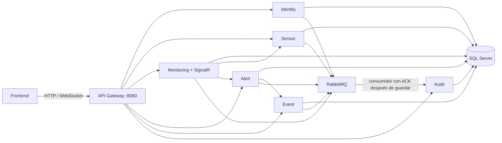

# Climate Monitoring System

## Cierre de Fase 2

- [Arquitectura y flujo de auditoría](docs/phase-2-architecture.md).
- [Kubernetes, imágenes, configuración y diagnóstico](docs/kubernetes.md).
- [Matriz de 68 RF y 8 RNF](docs/phase-2-compliance.md).
- [Resultados y comandos de validación](docs/phase-2-validation.md).

Las pruebas críticas verifican UpdateSensor con Audit detenido y recuperación
persistente con dos consumidores. El despliegue real Kubernetes permanece
pendiente de un clúster accesible; SQL sigue fuera de Kubernetes.

## Requisitos previos

Antes de iniciar, instala:

- .NET SDK **10.0.300** o una versión posterior de la familia 10.0 (`latestFeature` en `global.json`).
- Docker Desktop con Docker Compose v2, recomendado para ejecutar todo el sistema.
- PowerShell 5.1 o superior, necesario para regenerar el contrato OpenAPI.
- Opcional para ejecución sin Docker: SQL Server 2022 accesible en `localhost:1433`.

Verifica las herramientas:

```powershell
dotnet --version
docker --version
docker compose version
```

Los puertos predeterminados son `8080` para el Gateway, `1433` para SQL Server y `4200` para el frontend permitido por CORS. Deben estar libres.

## Descripción y objetivo

Backend de monitoreo climático construido con .NET 10 y microservicios. Registra comunidades y sensores, recibe o simula lecturas ambientales, calcula riesgos, produce alertas y eventos, conserva auditoría y transmite actualizaciones en tiempo real.

Su objetivo es exponer un único contrato HTTP estable mediante el API Gateway para que aplicaciones web puedan consultar y administrar el sistema sin acoplarse a las APIs internas.

## Arquitectura

Cada servicio aplica una separación Domain, Application, Infrastructure y Api. Los servicios poseen bases de datos independientes en una instancia de SQL Server. El Gateway es la única entrada pública y reenvía `/api/*` y `/hubs/monitoring` mediante YARP.



### Microservicios

| Servicio | Responsabilidad | Puerto local |
|---|---|---:|
| Identity | Registro, inicio de sesión JWT y usuarios | 5101 |
| Sensor | Comunidades, sensores y estado operativo | 5102 |
| Monitoring | Lecturas, simulación, estadísticas y SignalR | 5103 |
| Alert | Reglas, alertas y resolución | 5104 |
| Event | Historial de eventos climáticos | 5105 |
| Audit | Trazabilidad administrativa | 5106 |
| Gateway | Entrada pública y health agregado | 8080 |

### Tecnologías

.NET 10, ASP.NET Core Web API, Entity Framework Core 10, SQL Server 2022, JWT Bearer, SignalR, YARP, Swashbuckle/OpenAPI 3.0, xUnit, FluentAssertions, Moq, Testcontainers y Docker Compose.

## Configuración

1. Crea el archivo local de variables:

```powershell
Copy-Item .env.example .env
```

2. Cambia todos los valores `CHANGE_ME` en `.env`. Las claves JWT e interna deben tener al menos 32 caracteres y la contraseña de SQL Server debe cumplir su política de complejidad.

Variables principales:

| Variable | Uso |
|---|---|
| `SQLSERVER_SA_PASSWORD` | Contraseña del contenedor SQL Server |
| `JWT_SIGNING_KEY` | Firma de tokens; debe coincidir en todos los servicios |
| `INTERNAL_API_KEY` | Autenticación entre microservicios |
| `ADMIN_SEED_USERNAME`, `ADMIN_SEED_EMAIL`, `ADMIN_SEED_PASSWORD` | Administrador inicial |
| `DEMO_SEED_ENABLED` | Carga comunidades y sensores de demostración |
| `SIMULATION_ENABLED`, `SIMULATION_INTERVAL_SECONDS` | Simulador de lecturas |
| `FRONTEND_ORIGIN` | Origen permitido por CORS |
| `GATEWAY_PORT`, `SQLSERVER_PORT` | Puertos publicados |
| `RABBITMQ_HOST`, `RABBITMQ_PORT` | Dirección AMQP; Compose usa `rabbitmq:5672` en su red interna |
| `RABBITMQ_USER`, `RABBITMQ_PASSWORD` | Credenciales del broker, obligatorias y sin valores predeterminados en código |

No confirmes `.env` ni secretos reales en el repositorio.

## Auditoría con outbox — secciones 11–20

Identity, Sensor, Monitoring, Alert y Event guardan `AuditLogRequested` en una tabla
`AuditOutbox` de su propia base, dentro de la transacción de la operación HTTP.
Un worker publica eventos persistentes con confirmación de RabbitMQ y marca los
confirmados. Audit valida, guarda por EventId y ejecuta ACK después del commit.
Los fallos del broker dejan eventos pendientes para reintentar tras un reinicio.

Las consultas siguen pasando por Gateway. El endpoint HTTP interno de escritura
fue retirado. RabbitMQ mantiene sus puertos internos en Compose.

Este bloque también agrega último acceso y filtros de usuarios, creación
administrativa, geografía y conteos de comunidades, tipos/campos/filtros de sensores
y validación de sensores inactivos. Angular conserva sus pantallas y añade esos datos.

Detalles y límites: [secciones 11–20](docs/phase-2-sections-11-20.md).
Las acciones de reglas y atender/cerrar alertas ya están implementadas y verificadas
en el bloque de [secciones 21–30](docs/phase-2-sections-21-30.md).

Prueba aislada con RabbitMQ real: `powershell -File scripts/Test-AuditMessaging.ps1`.
Las migraciones nuevas se aplican con el mecanismo habitual de arranque de cada API;
no se deben omitir antes de iniciar el worker de outbox.

## Ejecutar con Docker (recomendado)

Desde la raíz:

```powershell
docker compose --env-file .env up -d --build --wait
docker compose --env-file .env ps
```

Comprueba el sistema en `http://localhost:8080/health`. Las migraciones se aplican automáticamente al arrancar cada API y los datos quedan en el volumen `climate-monitoring_sqlserver-data`.

Para ver registros o detenerlo sin borrar datos:

```powershell
docker compose --env-file .env logs -f
docker compose --env-file .env down
```

`docker compose down -v` también elimina todas las bases de datos; úsalo únicamente si deseas reiniciar los datos.

## Ejecutar localmente

1. Inicia SQL Server y un RabbitMQ accesible, crea `.env` y ajusta `RABBITMQ_*` y las seis variables `ConnectionStrings__*` de `.env.example`. Compose mantiene AMQP interno; para procesos .NET en el host configura un broker local o publica AMQP solo en loopback mediante un override local.
2. Carga esas variables en la terminal o configura los mismos valores con User Secrets.
3. Restaura, compila y ejecuta cada proceso en una terminal distinta:

```powershell
dotnet restore ClimateMonitoringSystem.sln
dotnet build ClimateMonitoringSystem.sln --no-restore
dotnet run --project src/Services/IdentityService/Climate.Identity.Api
dotnet run --project src/Services/SensorService/Climate.Sensors.Api
dotnet run --project src/Services/MonitoringService/Climate.Monitoring.Api
dotnet run --project src/Services/AlertService/Climate.Alerts.Api
dotnet run --project src/Services/EventService/Climate.Events.Api
dotnet run --project src/Services/AuditService/Climate.Audit.Api
dotnet run --project src/Gateway/Climate.Gateway
```

Los archivos `launchSettings.json` asignan los puertos 5101–5106. Las URLs locales de los servicios y las claves `*Service__ApiKey` deben coincidir con `InternalApi__ApiKey`.

## Migraciones

En Docker se aplican automáticamente. Para crear una migración nueva, sustituye `<Service>` y rutas por el servicio correspondiente:

```powershell
dotnet ef migrations add NombreMigracion --project src/Services/<Service>/<InfrastructureProject>.csproj --startup-project src/Services/<Service>/<ApiProject>.csproj --context <DbContext>
dotnet ef database update --project src/Services/<Service>/<InfrastructureProject>.csproj --startup-project src/Services/<Service>/<ApiProject>.csproj --context <DbContext>
```

No reutilices un `DbContext` ni una base entre servicios.

## Swagger y contrato para el frontend

La interfaz pública está disponible en `http://localhost:8080/swagger` y su JSON en `http://localhost:8080/swagger/v1/swagger.json`, también cuando Docker se ejecuta en Production. El contrato canónico y versionado es [`docs/openapi/climate-api-v1.json`](docs/openapi/climate-api-v1.json). Describe exactamente las rutas públicas del Gateway, cuerpos, parámetros, respuestas, esquemas y seguridad Bearer; excluye endpoints internos. Es el archivo que debe usarse para generar el cliente del frontend.

Para regenerarlo después de modificar controladores:

```powershell
docker compose -f docker-compose.yml -f docker-compose.swagger.yml --env-file .env up -d --build --wait
powershell -NoProfile -ExecutionPolicy Bypass -File scripts/export-openapi.ps1 -ComposeEnvFile .env
docker compose --env-file .env down
```

El archivo contiene `operationId` deterministas. Un ejemplo de generación para Angular es:

```powershell
npx @openapitools/openapi-generator-cli generate -i docs/openapi/climate-api-v1.json -g typescript-angular -o ../frontend/src/app/api
```

En modo Development, cada servicio expone además `/swagger` y `/swagger/v1/swagger.json` en su puerto directo. En Production solamente se publica la documentación unificada del Gateway.

Autenticación en Swagger: llama `POST /api/auth/login`, copia el valor de `accessToken`, pulsa **Authorize** y pega únicamente el token, sin el prefijo `Bearer`. Swagger UI agrega el prefijo y conserva la autorización al recargar. Para clientes HTTP envía `Authorization: Bearer <token>`. Registro e inicio de sesión son anónimos; el resto del contrato indica Bearer y documenta `401`/`403`.

## SignalR

El hub público está en `http://localhost:8080/hubs/monitoring`. El cliente debe enviar el JWT mediante `accessTokenFactory`. Los eventos disponibles son `ReadingReceived`, `AlertCreated`, `AlertResolved`, `SensorStatusChanged` y `SystemReset`.

## Pruebas

Ejecuta toda la suite:

```powershell
dotnet test ClimateMonitoringSystem.sln --no-restore
```

Algunas pruebas de integración usan Testcontainers y requieren Docker activo. Para cobertura:

```powershell
dotnet test ClimateMonitoringSystem.sln --collect:"XPlat Code Coverage"
```

## Endpoints públicos principales

Todas las rutas se consumen a través de `http://localhost:8080`:

- Autenticación: `/api/auth/register`, `/api/auth/login`.
- Usuarios: `/api/users`, `/api/users/me`, `/api/users/{id}`.
- Catálogo: `/api/communities`, `/api/sensors`.
- Monitoreo: `/api/monitoring/current`, `/api/monitoring/readings`, `/api/monitoring/sensors/{sensorId}/history`.
- Simulación: `/api/monitoring/simulation/status|start|stop|reset`.
- Alertas, eventos y auditoría: `/api/alerts`, `/api/events`, `/api/audit`.
- Reglas configurables: `/api/alert-rules`; crear, editar y activar/desactivar requiere Administrator.
- Workflow: `PATCH /api/alerts/{id}/attend` y `/close`, con responsable y validación de transición.
- Estadísticas: `/api/events/statistics?communityId=...&from=...&to=...`.
- Dashboard agregado: `/api/dashboard/summary?communityId=...`.
- Valores simulados persistentes: `/api/monitoring/simulation/values/{sensorId}`.
- Lecturas globales paginadas: `GET /api/monitoring/readings?communityId=...&sensorId=...&page=1`.

El detalle normativo de métodos, consultas y modelos está en el contrato OpenAPI; no dupliques manualmente esos tipos en el frontend.

## Datos iniciales

Al primer arranque se crea el administrador configurado en `ADMIN_SEED_USERNAME`, `ADMIN_SEED_EMAIL` y `ADMIN_SEED_PASSWORD`. Con los valores de ejemplo es `admin` / `CHANGE_ME_Admin_2026!`; cambia la contraseña antes de cualquier despliegue. Los roles disponibles son `Administrator`, `Operator` y `Viewer`.

Con `DEMO_SEED_ENABLED=true`, el Sensor Service agrega de forma idempotente tres comunidades de demostración —Ciudad de Guatemala, Puerto Barrios y Quetzaltenango— y quince sensores de temperatura, humedad, viento, lluvia y nivel de agua. El simulador de Monitoring genera lecturas para los sensores activos. Reiniciar los servicios no duplica estos registros.

## Kubernetes e imágenes — secciones 31–40

Los [manifiestos y pasos de configuración](k8s/README.md) mantienen SQL Server
en Docker y despliegan ocho aplicaciones y RabbitMQ en `climate-monitoring`.
Construye con `scripts/Build-Images.ps1 -IncludeFrontend` y verifica las imágenes
con `scripts/Test-Images.ps1`. Compose continúa disponible para desarrollo.

Consulta [los resultados y límites de validación](docs/phase-2-sections-31-40.md).

Las secciones 41–50 agregan retención explícita del PVC RabbitMQ, aislamiento de
red y reintentos de inicialización SQL. `scripts/Test-Images.ps1 -TestRecovery`
comprueba recuperación del broker, outbox e idempotencia con dos consumidores.
Consulta la [guía Kubernetes](k8s/README.md) para configuración, secretos, SQL
externo, sondas y límites del escalado.
La evidencia de esta entrega está en [secciones 41–50](docs/phase-2-sections-41-50.md).

Si el catálogo de vulnerabilidades de NuGet no está disponible, `NU1900` se
reporta como advertencia; las vulnerabilidades detectadas continúan tratándose
como errores. Una compilación con esa advertencia no acredita una revisión
actualizada de vulnerabilidades: repetir la consulta cuando vuelva la conexión.

## Solución de problemas

- **El contenedor SQL Server no está healthy:** valida complejidad de `SQLSERVER_SA_PASSWORD`, puerto 1433 y memoria disponible en Docker.
- **401:** renueva el token y confirma que issuer, audience y `JWT_SIGNING_KEY` coincidan en todos los servicios.
- **403:** el usuario está autenticado, pero su rol no permite la operación.
- **502/503 en Gateway:** ejecuta `docker compose --env-file .env ps` y revisa `docker compose --env-file .env logs <servicio>`.
- **CORS:** establece `FRONTEND_ORIGIN` con esquema, host y puerto exactos, sin comodines.
- **No aparecen datos demo:** confirma `DEMO_SEED_ENABLED=true`; el seed solo agrega registros faltantes.
- **Conflictos de puertos:** cambia `GATEWAY_PORT` o `SQLSERVER_PORT` en `.env`.
- **Regeneración OpenAPI falla:** inicia con `docker-compose.swagger.yml`; Swagger está deshabilitado en Production deliberadamente.

## Hostinger con Traefik

Consulta [la guía de despliegue](docs/hostinger.md) para usar el dominio con HTTPS.

