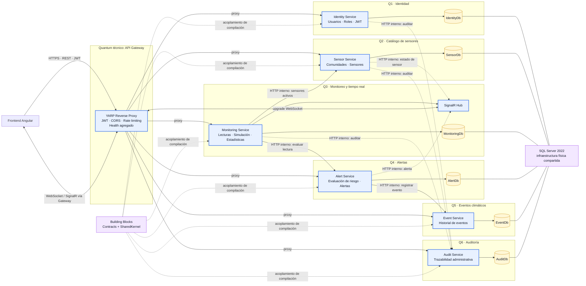
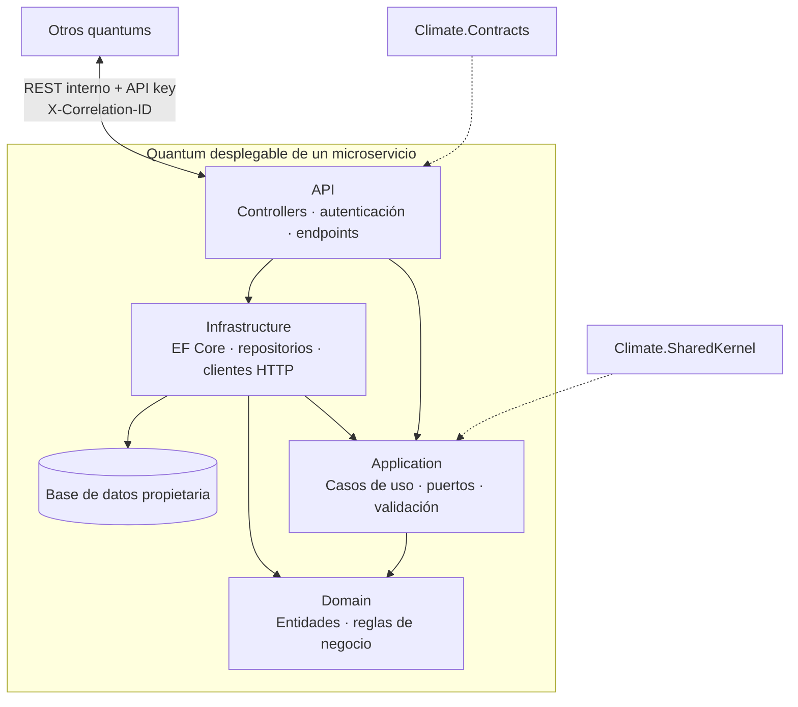

# Diagrama de quantums arquitectónicos

Un **quantum arquitectónico** es una unidad desplegable de alta cohesión funcional que incluye el código y los datos necesarios para cumplir una capacidad de negocio. En este sistema, cada microservicio y su base de datos lógica forman un quantum independiente. El Gateway constituye un quantum técnico sin datos propios.

## Vista de quantums y acoplamientos

## Anatomía común de un quantum de negocio

## Límites identificados

| Quantum | Artefacto desplegable | Datos propietarios | Acoplamiento dinámico saliente |
|---|---|---|---|
| Gateway | `Climate.Gateway` | Ninguno | Health checks y proxy hacia los seis servicios |
| Identidad | `Climate.Identity.Api` | `IdentityDb` | Audit |
| Sensores | `Climate.Sensors.Api` | `SensorDb` | Audit y Realtime en Monitoring |
| Monitoreo | `Climate.Monitoring.Api` | `MonitoringDb` | Sensors, Alerts y Audit |
| Alertas | `Climate.Alerts.Api` | `AlertDb` | Events y Realtime en Monitoring |
| Eventos | `Climate.Events.Api` | `EventDb` | Ninguno |
| Auditoría | `Climate.Audit.Api` | `AuditDb` | Ninguno |

Aunque las seis bases se alojan en una sola instancia de SQL Server, son límites lógicos separados: ningún servicio comparte tablas o `DbContext`. `Climate.Contracts` y `Climate.SharedKernel` son dependencias de compilación comunes, no unidades desplegables ni propietarios de datos.

El flujo `Monitoring → Alerts → Events`, al ser HTTP síncrono, forma el acoplamiento operativo más importante entre quantums. La auditoría y las notificaciones en tiempo real usan también HTTP interno; una evolución hacia mensajería y Outbox reduciría ese acoplamiento temporal sin cambiar los límites de dominio.
