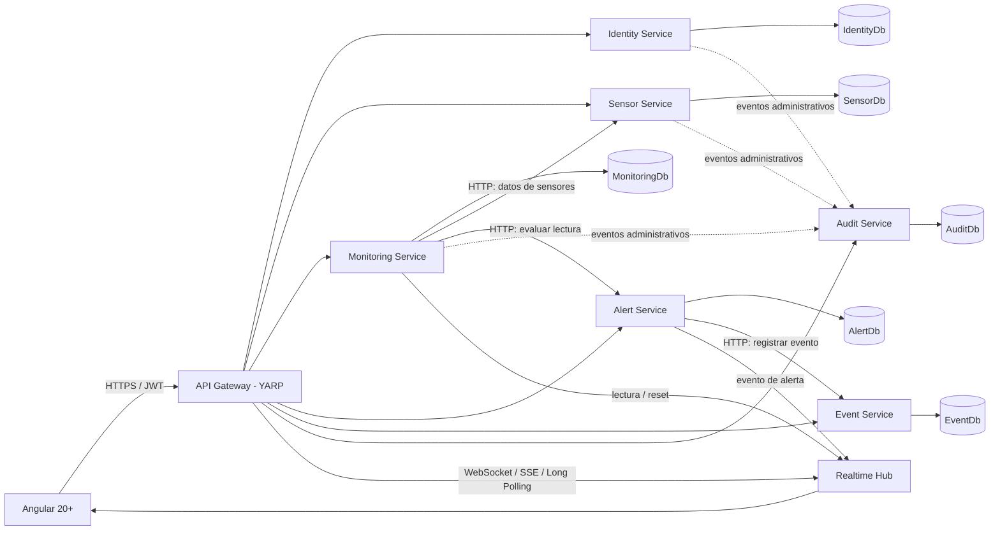
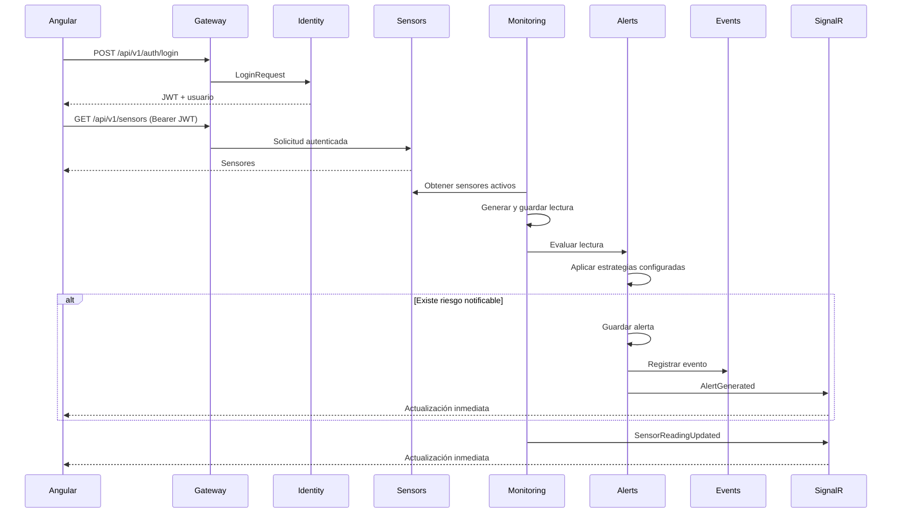

# Fase 1 — Diseño arquitectónico

## 1. Alcance

Esta fase define la arquitectura del backend del **Sistema Web de Monitoreo y Alerta Temprana para Riesgos Climáticos**. No incluye todavía proyectos .NET, código fuente, migraciones ni contenedores ejecutables.

La solución se implementará con microservicios independientes en .NET 10, un API Gateway con YARP, SQL Server 2022, JWT y SignalR. Cada servicio será propietario de sus datos y no accederá a tablas ni `DbContext` de otro servicio.

## 2. Arquitectura propuesta



Las líneas continuas representan operaciones necesarias para el flujo principal. Las líneas punteadas representan envío de registros de auditoría. En la primera versión académica, la comunicación interna será HTTP síncrona con contratos explícitos. Los límites permitirán reemplazar posteriormente esa comunicación por un broker de mensajes sin modificar el dominio de los servicios.

## 3. Responsabilidad de los componentes

### API Gateway

- Punto de entrada público para Angular.
- Enruta `/api/v1/auth`, `/users`, `/sensors`, `/communities`, `/monitoring`, `/alerts`, `/events`, `/audit` y `/dashboard`.
- Propaga `Authorization` y `X-Correlation-ID`.
- Aplica CORS, límites básicos de entrada, manejo uniforme de fallos del proxy y health check.
- No contiene lógica de negocio ni accede a bases de datos.
- Expone la ruta pública del Hub y soporta la actualización de conexión requerida por SignalR.

### Identity Service

- Registro, inicio de sesión y administración de usuarios.
- Hash seguro de contraseñas mediante `PasswordHasher<TUser>` de ASP.NET Core Identity, sin almacenar texto plano.
- Emisión de JWT con identidad y rol (`Administrator`, `Operator`, `Viewer`).
- Propietario de `IdentityDb`.
- Publica registros administrativos hacia Audit Service.

### Sensor Service

- Catálogo de comunidades, sensores, tipos, ubicación, unidad y estado operativo.
- Valida que cada sensor pertenezca a una comunidad existente en su propia base.
- Usa borrado lógico para conservar referencias históricas distribuidas.
- Propietario de `SensorDb`.

### Monitoring Service

- Recibe, genera y persiste lecturas.
- Controla el estado `START`, `STOP` y `RESET` de la simulación.
- Ejecuta un `BackgroundService` con intervalos y rangos configurables mediante Options Pattern.
- Consulta a Sensor Service los sensores activos; conserva solamente identificadores y datos necesarios en cada lectura, sin compartir tablas.
- Proporciona lectura actual, historial y series agregadas para gráficas.
- Solicita a Alert Service la evaluación de cada lectura persistida.
- Publica lecturas y reinicios al Hub.
- Propietario de `MonitoringDb`.

### Alert Service

- Evalúa lecturas mediante `IRiskEvaluationService`.
- Mantiene estrategias independientes por fenómeno (`Flood`, `Drought`, `Storm`, `Frost`, `ForestFire`).
- Obtiene umbrales y relaciones sensor-riesgo desde configuración tipada; los valores iniciales son exclusivamente de demostración.
- Persiste alertas y su ciclo de resolución.
- Solicita a Event Service el registro histórico y publica alertas en tiempo real.
- Propietario de `AlertDb`.

### Event Service

- Mantiene el historial inmutable de eventos climáticos y sus resoluciones.
- Permite consultas filtradas sin acceder a AlertDb, SensorDb o MonitoringDb.
- Propietario de `EventDb`.

### Audit Service

- Registra acciones administrativas con usuario, recurso, IP, instante UTC y correlation ID.
- Su escritura se realiza mediante una API interna autenticada; su consulta requiere rol `Administrator`.
- Una falla temporal de auditoría se registra localmente y no debe corromper la operación principal. La entrega garantizada mediante Outbox queda como evolución posterior.
- Propietario de `AuditDb`.

### Realtime Hub

El Hub se hospedará inicialmente en Monitoring Service para evitar un séptimo servicio operativo sin dominio propio. Alert Service publicará hacia un endpoint interno del Hub. Emitirá:

- `SensorReadingUpdated`
- `AlertGenerated`
- `SensorStatusChanged`
- `SystemReset`

Los mensajes contienen DTO, no entidades EF. El cliente podrá usar grupos por comunidad o sensor. En un despliegue con múltiples réplicas se incorporará Azure SignalR o un backplane compatible.

## 4. Bases de datos y propiedad de datos

Se utilizará una instancia SQL Server 2022 en Docker y seis bases lógicamente separadas:

| Base | Propietario | Información principal |
|---|---|---|
| `IdentityDb` | Identity Service | Usuarios, credenciales hash, roles |
| `SensorDb` | Sensor Service | Comunidades y sensores |
| `MonitoringDb` | Monitoring Service | Lecturas y estado de simulación |
| `AlertDb` | Alert Service | Alertas y estado de resolución |
| `EventDb` | Event Service | Historial de eventos climáticos |
| `AuditDb` | Audit Service | Bitácora administrativa |

Cada servicio tendrá credenciales/cadena de conexión configurables, `DbContext`, configuraciones y migraciones propias. Los identificadores externos se almacenan como valores (`Guid`) y no como claves foráneas entre bases. La consistencia entre servicios será eventual donde intervengan varias bases.

## 5. Comunicación entre servicios

### Comunicación externa

- Angular consume únicamente Gateway.
- REST JSON versionado bajo `/api/v1`.
- JWT Bearer se valida en Gateway como primera barrera y nuevamente en cada servicio protegido.
- SignalR se conecta a `/hubs/monitoring` a través del Gateway.

### Comunicación interna inicial

- `HttpClientFactory` con clientes tipados.
- Contratos en `BuildingBlocks/Contracts`, limitados a eventos y DTO compartidos de integración.
- Autenticación interna mediante un secreto o token de servicio provisto por variables de entorno; no se confía solamente en que la red Docker sea privada.
- Timeouts y cancelación obligatorios. Reintentos solamente en operaciones idempotentes.
- `X-Correlation-ID` se acepta o genera en Gateway y se propaga en todas las llamadas.

### Evolución prevista

Para producción, los eventos `ReadingRecorded`, `AlertGenerated` y `AdministrativeActionOccurred` pueden trasladarse a mensajería asíncrona con patrón Outbox. No se agrega un broker en la primera entrega porque no es requisito obligatorio y elevaría innecesariamente el coste operativo académico.

## 6. Flujo principal de datos



### Reinicio operativo

`POST /api/v1/monitoring/system/reset`:

- detiene temporalmente la simulación;
- elimina o marca como reiniciadas las lecturas simuladas según la política documentada en la implementación;
- restablece el estado y generadores de simulación;
- emite `SystemReset`;
- registra `ResetSystem` en Audit Service;
- conserva usuarios, comunidades, sensores, eventos, alertas y bitácora.

La política final de conservación de lecturas se implementará transaccionalmente dentro de MonitoringDb. No habrá transacción distribuida entre servicios.

## 7. Motor de riesgos

`IRiskEvaluationService` coordinará una colección de estrategias `IRiskStrategy`. Cada estrategia declara:

- fenómeno soportado;
- tipos de sensor requeridos;
- ventana de datos necesaria;
- regla de evaluación;
- nivel resultante y umbral usado.

Los umbrales se enlazan desde `RiskThresholdOptions` y se validan al iniciar. La configuración inicial se etiquetará como simulada y podrá reemplazarse en el futuro por un repositorio de reglas sin cambiar controllers ni contratos públicos.

Las reglas multivariable (por ejemplo, sequía o incendio) usarán lecturas recientes disponibles para una comunidad. Una lectura aislada puede producir una evaluación parcial, pero no inventará valores faltantes.

## 8. Seguridad y autorización

| Capacidad | Administrator | Operator | Viewer |
|---|:---:|:---:|:---:|
| Consultar dashboard, sensores, lecturas, alertas y eventos | Sí | Sí | Sí |
| Crear o modificar sensores y comunidades | Sí | Sí | No |
| Iniciar o detener simulación | Sí | Sí | No |
| Reiniciar sistema | Sí | No | No |
| Administrar usuarios | Sí | No | No |
| Consultar auditoría | Sí | No | No |

El registro público deberá poder deshabilitarse por configuración. El administrador inicial se crea desde variables de entorno. Swagger admitirá Bearer JWT. Los secretos se suministrarán mediante `.env` local no versionado o secretos del entorno de despliegue.

## 9. Dashboard

Para mantener responsabilidades claras, el Gateway no agregará datos de negocio. Los endpoints `/api/v1/dashboard/*` serán implementados por Monitoring Service como un Backend for Frontend liviano que consultará APIs de Sensors, Alerts y Events y combinará respuestas con timeouts. No accederá a sus bases directamente.

Si el volumen o la disponibilidad lo requieren, este módulo podrá separarse posteriormente como Query Service con proyecciones propias.

## 10. Estructura prevista de carpetas

```text
ClimateMonitoringSystem/
├── src/
│   ├── Gateway/
│   │   └── Climate.Gateway/
│   ├── BuildingBlocks/
│   │   ├── Climate.SharedKernel/
│   │   └── Climate.Contracts/
│   └── Services/
│       ├── IdentityService/
│       │   ├── Climate.Identity.Api/
│       │   ├── Climate.Identity.Application/
│       │   ├── Climate.Identity.Domain/
│       │   └── Climate.Identity.Infrastructure/
│       ├── SensorService/
│       │   ├── Climate.Sensors.Api/
│       │   ├── Climate.Sensors.Application/
│       │   ├── Climate.Sensors.Domain/
│       │   └── Climate.Sensors.Infrastructure/
│       ├── MonitoringService/
│       │   ├── Climate.Monitoring.Api/
│       │   ├── Climate.Monitoring.Application/
│       │   ├── Climate.Monitoring.Domain/
│       │   └── Climate.Monitoring.Infrastructure/
│       ├── AlertService/
│       │   ├── Climate.Alerts.Api/
│       │   ├── Climate.Alerts.Application/
│       │   ├── Climate.Alerts.Domain/
│       │   └── Climate.Alerts.Infrastructure/
│       ├── EventService/
│       │   ├── Climate.Events.Api/
│       │   ├── Climate.Events.Application/
│       │   ├── Climate.Events.Domain/
│       │   └── Climate.Events.Infrastructure/
│       └── AuditService/
│           ├── Climate.Audit.Api/
│           ├── Climate.Audit.Application/
│           ├── Climate.Audit.Domain/
│           └── Climate.Audit.Infrastructure/
├── tests/
│   ├── Climate.Identity.Tests/
│   ├── Climate.Sensors.Tests/
│   ├── Climate.Monitoring.Tests/
│   ├── Climate.Alerts.Tests/
│   ├── Climate.Events.Tests/
│   └── Climate.Audit.Tests/
├── docs/
│   └── Fase-1-Arquitectura.md
├── docker-compose.yml
├── .env.example
├── Directory.Build.props
├── Directory.Packages.props
├── ClimateMonitoringSystem.slnx
└── README.md
```

Aunque .NET moderno admite `.slnx`, se generará también `.sln` si las herramientas académicas lo requieren. Cada capa se referenciará hacia adentro: `Api -> Application`, `Infrastructure -> Application/Domain` y `Application -> Domain`. Domain no dependerá de EF Core, ASP.NET ni otros servicios.

## 11. Convenciones transversales

- Fechas en UTC con `DateTimeOffset`.
- Identificadores `Guid` generados por la aplicación.
- Problem Details uniforme y sin stack trace en producción.
- FluentValidation en la frontera de aplicación.
- OpenAPI por servicio y health checks de aplicación y SQL Server.
- Logging estructurado, sin tokens, contraseñas ni secretos.
- Respuestas paginadas para colecciones históricas.
- Nullable reference types, async/await y `CancellationToken` en I/O.
- Versiones de paquetes centralizadas para reducir divergencias.

## 12. Decisiones arquitectónicas relevantes

### ADR-001 — Comunicación inicial entre microservicios

**Problema:** se necesita coordinación entre Monitoring, Alerts, Events y Audit sin compartir datos.

**Alternativas:** HTTP síncrono; broker de mensajes; acceso directo entre bases.

**Decisión:** HTTP síncrono con clientes tipados y contratos explícitos en la primera versión; preparar interfaces para eventos asíncronos.

**Justificación:** satisface el alcance académico y simplifica Docker Compose. El acceso directo entre bases se descarta porque viola la propiedad de datos. Un broker es recomendable a mayor escala, pero no es obligatorio para demostrar el flujo.

### ADR-002 — Ubicación de SignalR

**Problema:** Monitoring y Alerts deben notificar al mismo frontend.

**Alternativas:** Hub en cada servicio; servicio Realtime dedicado; Hub en Monitoring.

**Decisión:** hospedar el Hub en Monitoring y ofrecer un endpoint interno para eventos de Alerts.

**Justificación:** entrega un único punto de conexión y evita un servicio adicional sin necesidad actual. La abstracción de publicación permitirá extraerlo después.

### ADR-003 — Consistencia distribuida

**Problema:** una alerta y su evento se guardan en bases distintas.

**Alternativas:** transacción distribuida; consistencia eventual; base compartida.

**Decisión:** consistencia eventual, operaciones idempotentes y correlation ID. Incorporar Outbox cuando se agregue mensajería.

**Justificación:** SQL y transacciones distribuidas acoplan servicios; compartir base contradice el requisito. La idempotencia permite recuperar fallos parciales.

### ADR-004 — Agregación del dashboard

**Problema:** Angular no debe hacer decenas de consultas y Gateway no debe asumir lógica de negocio.

**Alternativas:** agregación en Gateway; Query Service; módulo BFF en Monitoring.

**Decisión:** módulo BFF en Monitoring para la primera versión, consumiendo APIs públicas internas.

**Justificación:** Monitoring ya coordina el estado operativo y las lecturas. El módulo permanecerá aislado para poder extraerlo si crece.

### ADR-005 — Database per Service

**Problema:** seis servicios requieren independencia, pero el despliegue académico debe ser sencillo.

**Alternativas:** instancia por servicio; una base compartida; una instancia con bases separadas.

**Decisión:** una instancia de SQL Server 2022 con seis bases y migraciones independientes.

**Justificación:** conserva propiedad lógica y reduce consumo de recursos. Ningún servicio recibe permisos sobre la base de otro.

## 13. Verificación de esta fase

Antes de iniciar la Fase 2 se debe confirmar:

1. que los límites y responsabilidades de servicios son aceptables;
2. que HTTP síncrono es suficiente para la primera entrega;
3. que SignalR se alojará inicialmente en Monitoring Service;
4. que el dashboard agregado pertenecerá inicialmente a Monitoring;
5. que se usará una instancia SQL Server con seis bases separadas;
6. que los permisos iniciales por rol son adecuados.

No se ha generado código ni se ha avanzado a la Fase 2.
