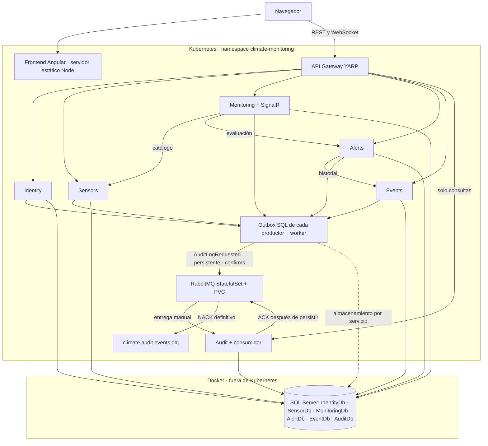

# Arquitectura final de Fase 2

El navegador obtiene Angular y su configuración runtime del frontend. REST y
SignalR se conectan al Gateway YARP, único punto de entrada backend. Cada API
conserva su modelo y base SQL. Kubernetes ejecuta imágenes previamente construidas;
SQL Server permanece en Docker en un host alcanzable desde el clúster.

## Contratos y flujo funcional

- Identity emite JWT con rol, expiración y firma configurables; las APIs validan
  autenticación y permisos. Angular usa guards e interceptor dirigido al Gateway.
- Sensors administra comunidades y sensores. Los inactivos no producen lecturas
  ni nuevas alertas. Monitoring conserva lectura, unidad y estado del sensor.
- Alerts evalúa reglas persistidas; los límites permitidos son inclusivos. Verde
  representa normalidad; para cada fenómeno prevalece la regla incumplida más grave.
  Las alertas guardan snapshot de regla, umbral y valor.
- El flujo Activa → Atendida → Cerrada registra responsables y fechas; las
  transiciones inválidas devuelven 409. Events conserva el historial y estadísticas.
- Dashboard agrega datos por comunidad y evolución de las últimas 24 horas por
  tipo/unidad. SignalR notifica seis tipos de eventos; los agregados se refrescan
  periódicamente y el frontend mantiene fallback REST cuando pierde la conexión.
- [OpenAPI](openapi/climate-api-v1.json) es el contrato público. Las rutas internas
  están excluidas y requieren una clave interna; Angular no las consume.

## Auditoría y garantías

El filtro transaccional guarda la modificación de negocio y `AuditOutbox` en la
misma base. Un worker publica JSON y marca `PublishedAt` tras confirmación del
broker. Un fallo antes de marcar puede volver a publicar el mismo `EventId`.
Audit usa ese ID como clave primaria, valida el evento y guarda antes del ACK.
Dos consumidores pueden competir sin crear dos filas del mismo evento.

El consumidor reintenta la persistencia tres veces usando contextos nuevos. JSON
inválido, errores de validación y fallos agotados terminan en DLQ. La reconexión al
broker y los reintentos de outbox son cada cinco segundos. Detener Audit o RabbitMQ
no convierte una modificación de sensor confirmada en un error funcional.

Las garantías son de entrega al menos una vez. La DLQ requiere revisión y reenvío
controlado conservando EventId; no existe un bucle de reenvío automático de mensajes
inválidos. No se elimina ni purga una cola durante operación normal.

## Límites operativos

Monitoring conserva una réplica porque simulación y SignalR no tienen coordinación
distribuida/backplane. RabbitMQ es un nodo persistente, no un clúster de alta
disponibilidad. Audit admite varias réplicas, sin garantía de orden global.
`/health/live` comprueba el proceso; `/health` incluye SQL o dependencias Gateway.
El estado HTTP de Audit no acredita que su consumidor esté conectado: revisar
también cola, outbox, DLQ y logs.

El cierre incluye [pruebas reproducibles](phase-2-validation.md),
[guía Kubernetes](kubernetes.md) y [matriz de requisitos](phase-2-compliance.md).
