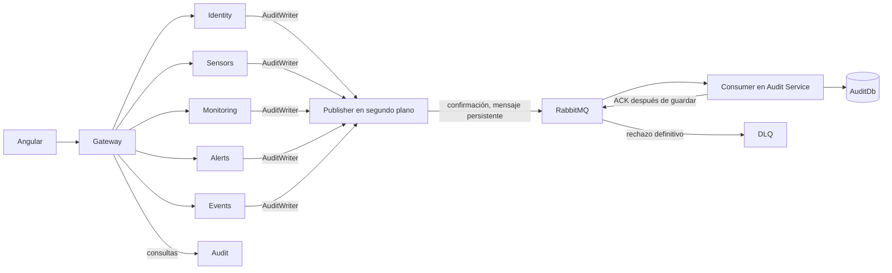

# Phase 2: primer bloque, secciones 1–10

Documento histórico del primer bloque. El buffer en memoria y el endpoint interno
de escritura descritos aquí fueron sustituidos/retirados en las
[secciones 11–20](phase-2-sections-11-20.md), que describen el estado actual.

## Alcance y análisis inicial

Se revisaron los repositorios locales `backend` y `frontend/climate-monitoring-web`,
y los [requisitos Phase 2](https://github.com/melgust/desaweb2026a/blob/main/phase_2.md)
el 27 de septiembre de 2026. Este bloque implementa la arquitectura de auditoría
de las secciones 1–10 del prompt. La sección 5 resume funcionalidades cuyos detalles
se encuentran en las secciones 16–32: se documentan como pendientes, sin presentar
este bloque como cumplimiento completo de Phase 2.

1. **Ya existente:** seis microservicios, YARP, bases independientes, JWT y roles,
   migraciones, seeds, consultas de auditoría, SignalR y pantallas Angular standalone.
2. **Parcial:** gestión de comunidades y sensores, administración de usuarios,
   alertas, eventos, filtros y dashboard. Su existencia no acredita todos los RF.
3. **Pendiente:** reglas configurables, atender/cerrar con responsable, último acceso,
   campos adicionales, estadísticas de eventos y agregación del dashboard.
4. **Retirado:** despliegue de servidor, dominio y configuración de producción
   excluidos expresamente por la sección 3. No se implementan.
5. **Backend en este bloque:** publisher común, sustitución de clientes HTTP,
   consumidor, persistencia de correlación y pruebas de desacoplamiento.
6. **Frontend en este bloque:** el detalle de auditoría muestra correlación cuando
   existe; todas las solicitudes siguen usando Gateway.
7. **RabbitMQ:** exchange directo durable, cola durable, mensajes persistentes,
   confirmación de publicación, ACK manual y DLQ.
8. **Docker:** servicio RabbitMQ con usuario propio, volumen persistente y health
   check. No publica AMQP ni la consola de administración.
9. **Kubernetes:** corresponde a secciones posteriores; no se crearon manifiestos.
10. **Riesgos:** pérdida previa al broker si reinicia el productor, saturación de la
    cola en memoria, nuevas variables obligatorias y migración de AuditDb.

## Flujo implementado



`AuditLogRequested` es el contrato compartido existente equivalente a AuditEvent.
`Resource` corresponde a Entity, `ResourceId` a EntityId y `OccurredAt` usa
DateTimeOffset UTC. No se añadió un segundo DTO con los mismos datos.
`EventId` se conserva como clave primaria de AuditLogs. `CorrelationId` proviene de
Activity.TraceId, con un identificador generado cuando no hay actividad.
Para operaciones internas sin sesión se usa el actor reservado
`ffffffff-ffff-ffff-ffff-ffffffffffff`, nombre `system`; no es una cuenta de Identity.

Identity, Sensor y Monitoring conservan sus llamadas a AuditWriter, que ahora
encola localmente. Alert publica resolución y evaluaciones; Event publica registros
internos. También se audita crear/editar comunidades. No existe dependencia de
AuditDb, repositorios de Audit ni de su disponibilidad en los productores.

### Topología

| Elemento | Nombre / comportamiento |
|---|---|
| Exchange | `climate.audit`, direct, durable |
| Routing key | `audit.created` |
| Queue | `climate.audit.events`, durable, no exclusiva |
| Dead-letter exchange | `climate.audit.dead`, direct, durable |
| DLQ | `climate.audit.events.dlq`, durable |
| Publicación | JSON, persistente, mandatory, publisher confirms |
| Consumo | entrega manual, guardar primero y ACK después |
| Fallo de persistencia | tres intentos con contexto nuevo; luego NACK sin requeue a DLQ |
| JSON o validación inválidos | DLQ sin retry |
| Caída de conexión | reconexión cada cinco segundos, cancelable |

La conexión y el canal del publisher se reutilizan, con un único worker por servicio.
El consumidor procesa un mensaje a la vez. Usa la consulta idempotente existente
por EventId y la clave primaria SQL; una colisión concurrente se reintenta con un
contexto nuevo. No se confirma una entrega antes de que termine SaveChangesAsync.
Los mensajes en DLQ requieren revisión y republicación controlada por un operador;
no hay reenvío automático infinito de mensajes inválidos.

## Configuración y ejecución

Las seis APIs requieren `RABBITMQ_HOST`, `RABBITMQ_USER`, `RABBITMQ_PASSWORD`;
`RABBITMQ_PORT` usa 5672 si se omite y valida el rango de puertos. No hay credenciales
guest predeterminadas. `.env.example` contiene exclusivamente placeholders.
Compose usa el DNS `rabbitmq` y el puerto interno 5672. Las antiguas variables
`AuditService__BaseUrl` y `AuditService__ApiKey` ya no configuran productores.

La migración `AddAuditCorrelation` agrega una columna nullable de 128 caracteres;
los registros existentes siguen siendo válidos. El arranque habitual de Audit
aplica sus migraciones antes de iniciar el consumidor. El campo también se añadió
al OpenAPI agregado existente y al modelo Angular de auditoría.

`GET /api/audit` y `GET /api/audit/{id}` siguen usando Gateway y autorización de
administrador. Se conserva por compatibilidad el endpoint interno heredado, pero
ningún productor lo utiliza para auditoría. Gateway, JWT, CORS y SignalR conservan
sus rutas y contratos previos.

## Garantías y límites

El fallo del broker o de Audit Service no se propaga a una operación funcional ya
guardada. El publisher mantiene hasta 10 000 eventos en memoria y reintenta en
segundo plano. Si el buffer está lleno registra un error crítico con el EventId.
Si reinicia el proceso productor antes de publicar, los eventos en memoria se
pierden. No hay atomicidad entre la transacción de negocio y el enqueue.

Los mensajes confirmados por RabbitMQ usan almacenamiento durable. El volumen
conserva sus datos al recrear el contenedor; eliminar el volumen elimina esos datos.
La prueba de recuperación cubre reinicio del consumidor, no pérdida de disco del broker.

El transactional outbox de la sección 12 sigue pendiente. No debe interpretarse el
buffer como una garantía de entrega completa ni como un outbox. Tampoco se añade
auditoría a todos los eventos futuros de la sección 15 que aún no existen.

## Matriz funcional de Phase 2

Estado basado en revisión de código y pruebas disponibles. `PARTIAL` no significa
que todo el flujo se haya probado de extremo a extremo. Los grupos incluyen todos
los requisitos enumerados; no se declara el producto completo por tener clases.

| Requirement | Backend | Frontend | Status | Missing Work / evidencia |
|---|---|---|---|---|
| RF-ADM-01–07 | Login, JWT, roles y políticas | AuthStore, guards, cierre local | PARTIAL | Conservar; pruebas Identity/guards. Falta validación E2E completa |
| RF-ADM-08–10 | Create/Update Community, estado en Update | Formularios existentes | PARTIAL | Municipality, Department, Country; revisar permiso exclusivo Administrator |
| RF-ADM-11–13 | Listado de comunidades | Lista y filtros locales | PARTIAL | Filtros geográficos en API y conteo de sensores sin N+1 |
| RF-ADM-14 | Consultas por comunidad parciales | DashboardStore sin filtro global | NOT IMPLEMENTED | Dashboard por comunidad |
| RF-ADM-15–17 | CRUD y estado de sensores | Formulario y acciones | PARTIAL | InstallationDate, Location y tipos ambientales adicionales |
| RF-ADM-18 | Validaciones de sensor activo en Monitoring | Estado visible | PARTIAL | Verificar motor de alertas y carreras al desactivar |
| RF-ADM-19–20 | Lista general | Filtros locales | PARTIAL | Filtros de comunidad/tipo/estado/código en API |
| RF-ADM-21 | Endpoint de lectura manual | Controles de simulación | PARTIAL | Edición de valor simulado y permiso Administrator |
| RF-ADM-22 | AuditWriter asíncrono en cambios de sensores | Consulta en bitácora | PARTIAL | Desacoplamiento probado; outbox pendiente |
| RF-ADM-23–26 | Historial, fecha/hora y valor | Historial/gráficos | PARTIAL | Snapshot de estado del sensor; verificar todos los filtros |
| RF-ADM-27 | Historial requiere sensorId | Consultas por sensor | PARTIAL | Consulta por comunidad sin una petición por sensor |
| RF-ADM-28 | Lecturas disponibles | Métricas y gráficos | PARTIAL | Completar evolución agregada en dashboard |
| RF-ADM-29–30 | No hay entidad configurable AlertRule | Sin feature alert-rules | NOT IMPLEMENTED | Persistencia, API y formularios |
| RF-ADM-31 | Green/Yellow/Orange/Red | Etiquetas de niveles | PARTIAL | Integración con reglas configurables |
| RF-ADM-32–36 | Evaluador con umbrales en código | Alertas sin administración de reglas | PARTIAL | Evaluación dinámica, RuleId, snapshots y CRUD |
| RF-ADM-37–40 | Lista, detalle y filtros parciales | Lista/detalle | PARTIAL | Filtros temporales y nuevo estado |
| RF-ADM-41–42 | isActive y Resolve | Resolver alerta | NOT IMPLEMENTED | Active/Attended/Closed, responsables y fechas |
| RF-ADM-43 | Consulta de alertas activas | ActiveAlertsPanel | PARTIAL | Conservar integración al introducir workflow |
| RF-ADM-44–47 | Eventos, fechas y filtros | Historial y detalle | PARTIAL | Valor, estado y usuario responsable |
| RF-ADM-48 | Sin endpoint de estadísticas de eventos | Sin estadísticas de eventos | NOT IMPLEMENTED | Agrupaciones por fenómeno/nivel/estado |
| RF-ADM-49–53 | Registro, editar/estado/rol | Lista, editar/detalle | PARTIAL | Creación administrativa segura y UI correspondiente |
| RF-ADM-54–55 | Lista sin filtros ni último acceso | Filtros locales | PARTIAL | LastLoginAt y filtros de servidor |
| RF-ADM-56–57 | Auditoría, EventId y correlación | Detalle con correlación | PARTIAL | Logout y futuras reglas/workflow; outbox |
| RF-ADM-58–59 | API administrativa de auditoría y filtros | Bitácora con filtros | PARTIAL | Conservar; pruebas de servicio y broker, falta E2E UI |
| RF-ADM-60 | Lista de comunidades | Sin contador de comunidades en dashboard | NOT IMPLEMENTED | Resumen administrativo |
| RF-ADM-61–63 | Sensores/alertas consultables | Contadores y alertas | PARTIAL | Consolidar resumen y comprobar todos los estados |
| RF-ADM-64–67 | Sin resumen agregado | Sin distribución/evolución/eventos completos | PARTIAL | Dashboard administrativo por comunidad |
| RF-ADM-68 | SignalR | Suscripciones reactivas | PARTIAL | Integrar nuevos módulos cuando existan |
| RNF-ADM-01–06 | Hashing, JWT, expiración, políticas | Guards e interceptor | PARTIAL | Pruebas existentes; revisar políticas de altas y administración |
| RNF-ADM-07 | Credenciales RabbitMQ por variables | Sin acceso a RabbitMQ | PARTIAL | Configuración sin secretos nuevos; sin auditoría exhaustiva histórica |
| RNF-ADM-08 | Auditoría asíncrona de acciones existentes | Consulta administrativa | PARTIAL | Cobertura completa de acciones y outbox |
| Infraestructura excluida por sección 3 | Fuera del bloque | Fuera del bloque | NOT APPLICABLE | OUT OF CURRENT SCOPE |

## Verificación reproducible

```powershell
dotnet build ClimateMonitoringSystem.sln
dotnet test ClimateMonitoringSystem.sln
docker compose --env-file .env.example config --quiet
powershell -File scripts/Test-AuditMessaging.ps1
```

La prueba con Docker crea credenciales aleatorias, broker y volumen exclusivos;
solo publica AMQP en loopback. Retira esos recursos al terminar. No usa bases ni
colas de la aplicación. Sin `CLIMATE_RABBITMQ_INTEGRATION=1` la prueba de broker se
marca explícitamente como omitida; el script la activa.

La prueba de persistencia usa SQLite relacional y los servicios/repositorios reales
de Audit. La prueba de actualización de sensor usa su controlador, servicio y
repositorio reales con EF InMemory y un transporte de auditoría que falla.
No equivale a ejecutar todo el sistema con SQL Server y navegador.

### Resultado del 27 de septiembre de 2026

| Comprobación | Resultado |
|---|---|
| Compilación backend | Sin errores ni advertencias |
| Suite backend con broker real aislado | 91 aprobadas, 0 omitidas |
| Consumidor detenido/reiniciado, duplicados y DLQ | Aprobado con RabbitMQ 4.1 |
| UpdateSensor con transporte de auditoría caído | Respuesta correcta y cambio persistido en EF InMemory |
| EF `has-pending-model-changes` | Sin cambios pendientes |
| Docker Compose `config --quiet` | Correcto |
| Angular build / lint | Correctos |
| Angular tests | 36 aprobadas en 9 archivos |

Se usó .NET SDK 10.0.400. Para Angular se descargó Node 24.21.0 portable y se
verificó su SHA256 oficial, porque Node 22.13.0 del host no cumplía el mínimo del
CLI instalado. Se restauraron las dependencias con `npm ci` sin cambiar el lockfile.
La instalación global de Node no se modificó. No se aplicó la migración a una base
de datos de usuario ni se desplegó el sistema completo. Los recursos Docker de
prueba fueron retirados.

Referencia del cliente: [RabbitMQ .NET API](https://www.rabbitmq.com/client-libraries/dotnet-api-guide).
