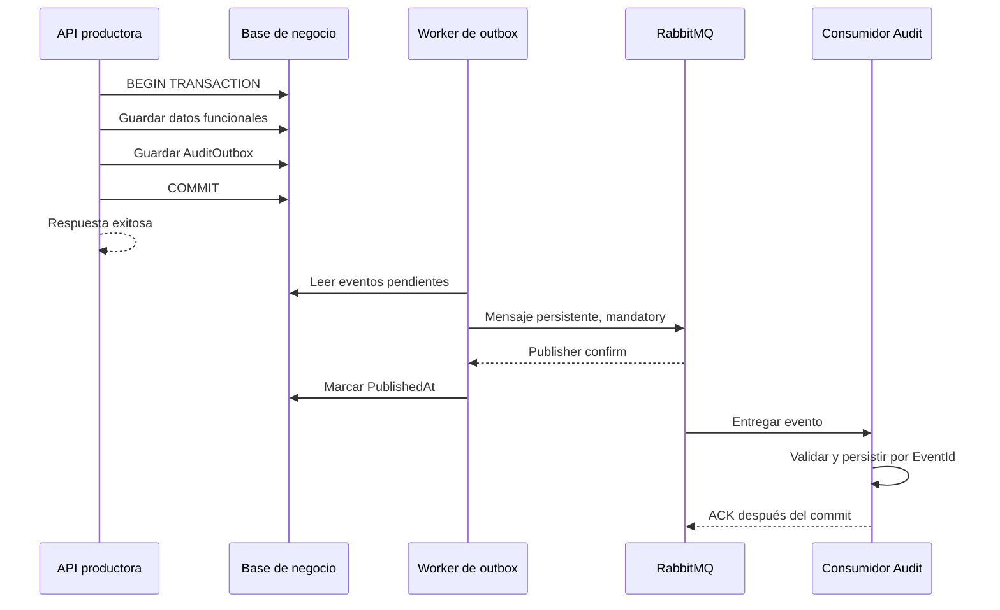

# Phase 2 — secciones 11–20

Este documento describe el estado al cerrar ese bloque. La dependencia pendiente
de la sección 15 ya se completó en [secciones 21–30](phase-2-sections-21-30.md),
que también documenta los cambios posteriores del workflow y la ruta Resolve.

## Estado del bloque

| Sección | Estado | Evidencia |
|---|---|---|
| 11. Eliminar HTTP de escritura | Implementada | Eliminado InternalAuditController; productores usan outbox, sin URL ni clave de Audit Service |
| 12. Resiliencia | Implementada para operaciones HTTP con datos SQL | AuditTransactionFilter, AuditOutbox y OutboxAuditWorker en los cinco productores; pruebas de rollback y recuperación |
| 13. Idempotencia | Implementada | EventId es la PK de AuditLogs; consulta previa, restricción de base y reintento con contexto nuevo |
| 14. Consumidor | Implementada | Validación, tres intentos máximos de persistencia, DLQ y ACK posterior a guardar |
| 15. Acciones | Parcial por dependencias posteriores | Operaciones existentes auditadas; nombres y clasificación de reglas/Attend/Close preparados. Sus operaciones todavía corresponden a las secciones 23–25 |
| 16. Usuarios | Implementada | LastLoginAt, filtros API/UI y creación administrativa con rol |
| 17. Comunidades | Implementada | Geografía, estado, filtros y conteo con una consulta SQL |
| 18. Sensores | Implementada | Tipos nuevos, Other + EnvironmentalType, instalación y ubicación |
| 19. Inactivos | Implementada en los tres puntos de entrada | Lectura manual, simulador y comprobación actual de estado en Alert Service |
| 20. Filtros de sensores | Implementada | communityId, type, isActive, code y search en API y Angular |

Los nuevos campos de catálogo son opcionales para conservar datos históricos y
clientes anteriores. No se inventaron municipios, países ni fechas de instalación
para registros existentes. Los formularios permiten completar esos datos.

## Problema y decisión de auditoría

El bloque anterior evitaba errores funcionales causados por el broker mediante una
cola en memoria. Esa cola perdía eventos pendientes al reiniciar el productor.
Se reemplazó su registro de producción por un **transactional outbox** en cada base
de negocio: IdentityDb, SensorDb, MonitoringDb, AlertDb y EventDb.

### Implementación

- Un filtro MVC scoped abre la transacción antes de cada acción POST/PUT/PATCH/DELETE.
  Todos los SaveChanges de esa acción usan el mismo DbContext/transacción.
- AuditWriter conserva usuario, IP, correlación, acción, entidad e identificador;
  `OutboxAuditPublisher<TContext>` agrega el mensaje al contexto de negocio.
- Si la acción termina con error o excepción, la transacción se revierte. Antes de
  responder éxito se guarda el outbox y se confirma la transacción.
- El worker lee lotes de hasta 100 filas, publica secuencialmente y marca PublishedAt
  solo tras la confirmación del broker. Los fallos dejan las filas pendientes.
- El worker vuelve a intentar cada cinco segundos. Cada envío tiene un timeout de
  15 segundos. No elimina eventos sin confirmación.
- Un reinicio entre confirmación RabbitMQ y actualización PublishedAt puede repetir
  la entrega. La PK EventId de AuditLogs impide filas duplicadas.
- Varias réplicas productoras pueden publicar la misma fila. La implementación
  admite esa duplicación; no promete entrega exactamente una vez.
- Las consultas administrativas siguen en Gateway: GET `/api/audit` y
  GET `/api/audit/{id}`. El endpoint HTTP interno de escritura fue retirado.
- La implementación previa de buffer queda únicamente para pruebas históricas;
  su método de registro fue retirado y ninguna API la usa.

### Trade-offs y límites

La transacción SQL permanece abierta durante la acción del controlador, incluidas
las llamadas internas ya existentes. Esto aumenta su duración; no convierte las
llamadas a Event Service o SignalR en una transacción distribuida. Una evolución
posterior puede trasladar también esos efectos a eventos propios.

Start/Stop de simulación conservan su estado operativo en memoria. Su registro se
guarda durablemente antes de responder, pero el estado en memoria no participa en
rollback SQL. Reset de lecturas sí participa en la transacción SQL local.

Los eventos confirmados permanecen en AuditOutbox con PublishedAt para diagnóstico.
No se añadió borrado automático; debe definirse una retención antes de crecer a
gran volumen. La garantía cubre datos confirmados: una petición fallida o una base
de negocio indisponible puede responder error y no se presenta como operación
confirmada. Audit Service o RabbitMQ caídos no afectan la transacción de negocio.

## Consumidor e idempotencia

Se conservan colas durables, mensajes persistentes y confirmaciones del bloque
anterior. Audit valida también longitudes de columnas y una fecha no vacía antes
de acceder al repositorio. JSON inválido o validación fallida van directamente a
DLQ. Los errores al guardar tienen tres intentos, cada uno con scope/contexto nuevo;
agotados los intentos, NACK sin requeue dirige el evento a DLQ.

Una caída de conexión produce reconexión, no ACK. Los eventos no confirmados pueden
volver a entregarse. La PK sobre EventId es la protección final ante consumidores
concurrentes; la consulta por EventId evita inserciones repetidas ordinarias.

## Acciones disponibles y dependencias de la sección 15

Están conectadas: Login, Logout, Create, Update, Delete lógico, Activate, Deactivate,
StartSimulation, StopSimulation, ResetSimulation y ResetSystem. También se conservan
las acciones internas de evaluación, resolución y registro de eventos existentes.
La creación administrativa registra al administrador; el registro público registra
al nuevo usuario. No se copian contraseñas ni cuerpos HTTP a la bitácora.

`CreateAlertRule`, `UpdateAlertRule`, `ActivateAlertRule`, `DeactivateAlertRule`,
`AttendAlert` y `CloseAlert` tienen nombres compartidos y clasificación en el filtro.
**No se marca su ejecución como implementada:** aún no existen los endpoints de
reglas ni el workflow atendida/cerrada. Se conectarán al implementar las secciones
23–25. El endpoint histórico Resolve sigue funcionando con su acción existente.

Logout envía el JWT al backend para registrar el evento y elimina la sesión local.
Si la API está inaccesible, Angular igualmente permite salir; no puede garantizar
un registro de logout que no llegó al servidor. No se añadió blacklist de JWT;
los tokens mantienen su expiración original.

## Cambios funcionales

### Usuarios

- LastLoginAt se actualiza después de validar contraseña, estado y generación del
  token. Un login fallido no lo modifica. Se muestra en el listado administrativo.
- GET `/api/users?search=...&role=Operator&isActive=false` filtra en la base.
- POST `/api/users` crea un usuario con rol, exclusivamente para Administrator.
  Registro y asignación de rol forman una sola transacción con la auditoría.
- Nueva pantalla `/users/new`; siguen disponibles editar y activar/desactivar.

### Comunidades

- Municipality, Department y Country en dominio, DTO, base y formularios.
- GET `/api/communities` acepta search, isActive, municipality y department.
- SensorCount se calcula mediante una subconsulta COUNT en el SELECT del listado,
  sin cargar los sensores ni ejecutar una consulta por comunidad. Incluye activos
  e inactivos asociados. El detalle también devuelve su conteo.
- PATCH `/api/communities/{id}/activate` y `/deactivate` requieren Administrator;
  crear/editar también se restringen a ese rol en API y navegación.

### Sensores

Se mantienen los valores existentes del enum, especialmente WaterLevel = 4, para
no reinterpretar datos almacenados. Se agregan RiverLevel, ReservoirLevel, Smoke
y Other. Other exige EnvironmentalType, que permite describir nuevos tipos sin
agregar un valor al enum por cada sensor ambiental.

InstallationDate (DateOnly), Location y EnvironmentalType se almacenan y se muestran
en formularios/detalle. Los nuevos tipos atraviesan contratos, Monitoring, Angular
y simulador. RiverLevel/ReservoirLevel usan el rango de agua existente; Smoke/Other
tienen un rango genérico de demostración 0–100. No se agregan umbrales de riesgo
inventados para estos tipos: su configuración de reglas corresponde al bloque
posterior; RiskRules existente acepta los nuevos tipos por configuración.

GET `/api/sensors` acepta communityId, type, isActive, code y search. El listado
Angular envía esos filtros mediante Gateway al pulsar «Aplicar filtros».

### Sensores inactivos

El catálogo interno excluye sensores o comunidades inactivos. Monitoring además
comprueba IsActive al crear lecturas manuales y al recorrer la simulación. Alert
Service consulta el estado actual del sensor/comunidad antes de evaluar reglas;
una lectura recibida para un sensor inactivo no crea ni modifica alertas.

La consulta entre servicios es una comprobación puntual, no un bloqueo distribuido:
una desactivación concurrente después de la consulta requiere coordinación adicional
si se necesita una garantía estricta bajo carreras. No se añadió un lock distribuido.

## Migraciones y OpenAPI

Se agrega `Phase2OutboxAndCatalog` en cada productor. Las migraciones añaden tablas y
columnas; no borran ni reinterpretan registros existentes. Se verificó que los seis
modelos no tengan cambios pendientes de migración. No se aplicaron estas migraciones
a las bases de datos del usuario durante las pruebas.

OpenAPI agregado fue regenerado desde las seis APIs compiladas. `OpenApi__ExportOnly=true`
permite exportar con Swagger CLI sin inicializar bases ni iniciar workers de negocio.
Ese modo debe usarse solo para exportación. El script `export-openapi.ps1` conserva
el modo Compose y agrega `-InputDirectory` para combinar documentos exportados.

## Verificación

Resultados: 107 pruebas backend aprobadas entre la ejecución completa con RabbitMQ
y la ejecución posterior de los seis casos nuevos de clasificación; 41 pruebas
frontend aprobadas. Build .NET sin advertencias ni errores, build y lint Angular
correctos, configuración Docker Compose válida y seis modelos sin cambios de
migración pendientes. Los recursos temporales de RabbitMQ se eliminaron al terminar.

- Prueba relacional SQLite con controlador, servicio, repositorio y filtro reales:
  commit conjunto, rollback conjunto, fallo del broker y recuperación con un nuevo
  provider/worker leyendo el mismo archivo de base.
- Prueba de filtros y conteo: interceptor SQL confirma exactamente una consulta
  para listar comunidades con número de sensores.
- Validación de LastLoginAt en login correcto y contraseña incorrecta.
- Lectura manual/simulada y evaluación de alertas rechazan sensores inactivos.
- Consumidor: JSON inválido, validación, recuperación transitoria y límite de reintentos.
- RabbitMQ real aislado: consumidor detenido/reiniciado, duplicados y DLQ.
- Angular: filtros enviados por HTTP, logout con JWT antes de borrar sesión, build,
  lint y pruebas existentes.

Las pruebas relacionales usan SQLite; los snapshots/migraciones se verificaron con
el proveedor SQL Server. No equivalen a una prueba integral de todo el despliegue
con SQL Server y navegador.
