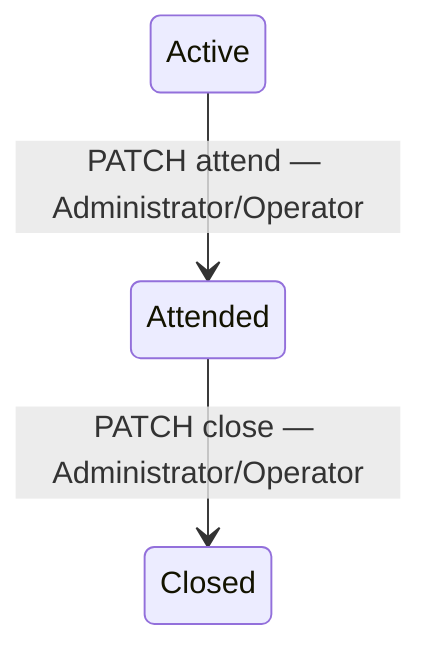

# Phase 2 — secciones 21–30

## Alcance y análisis inicial

Se continuaron los proyectos existentes y se contrastó el bloque con los
[requisitos oficiales de Phase 2](https://github.com/melgust/desaweb2026a/blob/main/phase_2.md).
La autorización del usuario abarca la implementación de las secciones 21–30.

- Ya existían JWT, roles, lecturas manuales, simulación, consultas históricas,
  evaluación por configuración, eventos, SignalR y las pantallas del catálogo.
- Faltaban reglas persistentes editables, atención/cierre con responsable,
  valores simulados persistentes, consultas globales de lecturas, estadísticas
  y resumen del dashboard por comunidad.
- Se conservaron Gateway, los seis servicios, las bases independientes, Angular,
  el outbox y RabbitMQ. No se añadieron servicios ni proyectos frontend.
- Docker solo se ajustó para proporcionar a Monitoring la URL de Events.
  Kubernetes y los cambios de despliegue corresponden a los bloques posteriores.
  VPS, dominio y HTTPS de producción siguen fuera del alcance solicitado.
- Los riesgos principales eran perder estados históricos, romper los nombres
  SignalR o permitir saltos en el workflow. Se verificaron migraciones, contratos,
  transiciones y comunicación real por Gateway.

## Matriz del bloque

| Sección / requisito | Backend | Frontend | Estado | Evidencia |
|---|---|---|---|---|
| 21 / RF-ADM-21 | GET/PUT/DELETE simulation/values; tabla SimulationOverrides | Valor fijo y volver a aleatorio en detalle de sensor; Administrator | COMPLETED | Prueba SQL: valor guardado 75 y siguiente lectura simulada 75 |
| 22 / RF-ADM-23–28 | Consulta global paginada, filtros combinados, estado histórico | `/readings`, comunidad/sensor/fechas y paginación | COMPLETED | Pruebas de filtros y consulta real por Gateway |
| 23 / RF-ADM-29–31,35 | AlertRules, validación, listado/detalle/crear/editar/estado | `/alert-rules`, `/new`, `/:id/edit`; escritura solo Administrator | COMPLETED | CRUD lógico SQL, tests de intervalos y HTTP 403 para Viewer |
| 24 / RF-ADM-32–34,36 | Evaluador asíncrono de reglas activas en SQL; snapshots | Regla, límites y valor en detalle de alerta | COMPLETED | Lectura manual genera alerta con RuleId; regla desactivada no genera otra |
| 25 / RF-ADM-37,38,40–42 | Active → Attended → Closed, actor, fechas y rowversion | Acciones Atender/Cerrar con confirmación y detalle | COMPLETED | HTTP 409 ante saltos/repeticiones; responsables persistidos |
| 26 / RF-ADM-39 | from/to/communityId/sensorId/riskType/alertLevel/status | Filtros de alertas con fechas y tres estados | COMPLETED | Contratos HTTP y consultas reales |
| 27 / RF-ADM-44–48 | Valor/estado/responsable y GROUP BY SQL para estadísticas | Historial y detalle enriquecidos; totales por fenómeno/nivel/estado | COMPLETED | Estadísticas SQL tras cerrar alerta, filtros unitarios |
| 28 / RF-ADM-14,60–68 | `/api/dashboard/summary?communityId=...` | Conteos, distribución, eventos y gráficas de 24 horas | COMPLETED | Agregación real en SQL Server y aislamiento del filtro en test frontend |
| 29 / RF-ADM-68 | Conserva cuatro nombres originales; añade AlertAttended/AlertClosed | Los nuevos eventos actualizan el flujo existente de alertas | COMPLETED | Se reciben los seis eventos por WebSocket del Gateway |
| 30 | Nuevos contratos publicados por Gateway/OpenAPI | Features existentes ampliadas; usuarios/comunidades conservan 11–20; auditoría sugiere nuevas acciones | COMPLETED | Build/lint y 48 pruebas frontend |

También queda completada la dependencia de la sección 15: CreateAlertRule,
UpdateAlertRule, ActivateAlertRule, DeactivateAlertRule, AttendAlert y CloseAlert
se guardan en el outbox con usuario y recurso. La prueba funcional confirmó las
seis acciones pendientes en SQL con RabbitMQ apagado.

## Contratos y decisiones

Todas las rutas siguientes son públicas exclusivamente a través del Gateway;
internamente las APIs mantienen el prefijo `/api/v1`.

### Simulación y lecturas

- `GET/PUT/DELETE /api/monitoring/simulation/values/{sensorId}`. PUT recibe
  `{ "value": 75 }`; DELETE restablece el generador aleatorio. El valor fijo
  persiste entre reinicios y no modifica metadatos ni lecturas anteriores.
- PUT exige un sensor activo en una comunidad activa y el rol Administrator.
  El simulador lee los valores fijos en una consulta por lote. Desactivar el
  sensor impide generar lecturas incluso si tiene un valor fijo configurado.
- `GET /api/monitoring/readings` admite communityId, sensorId, from, to, page y
  pageSize. Devuelve `{ items, total, page, pageSize }`; máximo 500 filas por página.
  La UI usa páginas de 100. Se filtra y pagina en SQL, sin una petición por sensor.
- SensorWasActive es un snapshot de la lectura, no el estado actual del catálogo.
  Es null en datos anteriores sin evidencia histórica. Fechas nuevas y antiguas
  se normalizan a UTC conservando el instante representado.

### Reglas

`GET /api/alert-rules`, `GET /api/alert-rules/{id}`, POST, PUT y PATCH
`/{id}/activate|deactivate` implementan los endpoints del prompt. La eliminación
funcional es la desactivación; no hay DELETE que elimine trazabilidad.

MinimumValue y MaximumValue definen el intervalo permitido, con extremos inclusivos.
Una lectura menor al mínimo o mayor al máximo incumple la regla. Al menos un
extremo es obligatorio; los límites y lecturas admiten valores de -1 000 000 a
1 000 000. Verde representa normalidad y no crea alertas. Si varias reglas del
mismo fenómeno coinciden, prevalece la mayor gravedad; empates se ordenan por Id.

Al iniciar una base sin reglas, los umbrales existentes de appsettings se importan
como reglas editables. Se conserva su comparación inclusiva mediante un ajuste de
0.0001, acorde con la precisión decimal almacenada. Después, la evaluación consulta
SQL y refleja cambios de reglas en la siguiente lectura. Desactivar todas las
reglas no reactiva automáticamente la configuración antigua.

La alerta conserva RuleId, RuleName, MinimumValueSnapshot, MaximumValueSnapshot y
ThresholdValue del último análisis aplicado. Editar una regla no reescribe las
alertas históricas. Una lectura posterior puede actualizar el análisis de una
alerta aún abierta; conserva su atención y responsable.

### Workflow e historial



Saltos, repetición de atención/cierre y cambios posteriores al cierre responden
409. El usuario responsable procede del JWT, nunca del cuerpo enviado por el cliente.
Rowversion detecta actualizaciones concurrentes de la misma alerta y devuelve 409.
Una lectura normal no cierra automáticamente alertas del nuevo motor.

Por compatibilidad se mantienen IsActive y ResolvedAt: IsActive significa abierta
(Active o Attended). La ruta antigua `PATCH /api/alerts/{id}/resolve` permanece
como alias de cierre y también exige haber atendido la alerta previamente.

El historial conserva un registro por alerta y actualiza su estado, valor y
responsable. No representa una fila independiente por cada lectura; los cambios
de usuario están además en auditoría. Eventos antiguos conservan Value y
ResponsibleUserId nulos cuando no existía esa información.

`GET /api/events/statistics` filtra communityId/from/to y devuelve total,
byRiskType, byAlertLevel y byStatus. El agrupamiento se realiza en SQL. En la
pantalla, las estadísticas corresponden a comunidad/período, mientras el listado
también permite limitar sensor, fenómeno y nivel.

### Dashboard y SignalR

Monitoring agrega datos de catálogo, alertas y eventos mediante las URLs
configuradas, propagando el JWT. Angular realiza una petición de resumen, sin
acceder a microservicios directamente. Los conteos del filtro son de la comunidad
seleccionada; el selector conserva todas las comunidades disponibles.

ActiveAlertCount cuenta solo Active. El panel y la distribución incluyen alertas
abiertas (Active y Attended). Las gráficas agrupan por hora, tipo y unidad las
lecturas de las últimas 24 horas. No se mezclan unidades distintas.

Se conservan SensorReadingUpdated, AlertGenerated, SensorStatusChanged y
SystemReset, y se añaden AlertAttended y AlertClosed. El cliente integra los dos
nuevos nombres en el flujo existente de actualizaciones de alertas. Las lecturas
recibidas por SignalR respetan el filtro de comunidad. El resumen completo también
se refresca cada 30 segundos para actualizar conteos y series agregadas.

## Migraciones y límites

Las migraciones `Phase2RulesWorkflowAndReadings` afectan a Monitoring, Alerts y
Events. Las alertas antiguas se convierten a Active/Closed según IsActive y los
eventos según ResolvedAt, sin inventar usuarios responsables. Las migraciones
se aplicaron únicamente en SQL Server temporal durante las pruebas.

No se modificaron las bases del usuario. El arranque habitual de las APIs aplica
las migraciones mediante sus inicializadores existentes.

El outbox protege la auditoría de los comandos HTTP. Las llamadas actuales entre
servicios para evaluar alertas, registrar eventos y publicar SignalR siguen siendo
HTTP: no hay una transacción distribuida que abarque esos efectos. SignalR puede
notificar antes del commit final; las consultas y el refresco del dashboard
reconcilian el estado. La simulación sigue ejecutándose en memoria con valores
persistidos; coordinar varias réplicas del simulador corresponde a una decisión
posterior de despliegue. No se afirma una garantía de entrega duradera de SignalR.

El resumen reduce las llamadas desde Angular; internamente aún descarga los
listados de catálogo y alertas abiertas. Para catálogos muy grandes convendrá
añadir proyecciones de resumen específicas en esos servicios.

## Validación reproducible

Desde backend:

```powershell
dotnet build ClimateMonitoringSystem.sln
powershell -NoProfile -ExecutionPolicy Bypass -File scripts/Test-Phase2Functional.ps1
powershell -NoProfile -ExecutionPolicy Bypass -File scripts/Test-AuditMessaging.ps1
```

La prueba funcional usa SQL Server Docker temporal, credenciales aleatorias,
puertos locales configurables, las seis APIs compiladas y Gateway. Valida JWT,
autorización, endpoints, migraciones, consultas SQL, simulación, WebSocket y
outbox. El broker permanece inaccesible durante esa prueba. Al terminar elimina
sus procesos y contenedor; conserva los logs en el directorio temporal indicado.
La segunda prueba ejecuta la suite con un RabbitMQ aislado y también limpia sus
recursos. Ambas necesitan Docker activo e imágenes disponibles.

Resultados del bloque:

- 119 pruebas backend aprobadas con RabbitMQ real, sin omisiones.
- 48 pruebas frontend aprobadas; build de producción y lint correctos.
- Prueba funcional SQL Server/Gateway/JWT/WebSocket aprobada, incluidas seis
  acciones de auditoría persistidas con RabbitMQ apagado.
- OpenAPI regenerado desde las seis APIs; seis modelos sin migraciones pendientes.
- No se realizó una prueba automatizada de navegación visual con navegador.

Se actualizaron los README y el contrato `docs/openapi/climate-api-v1.json`.
